[TOC]


---

# 1. 23GOF总览

| 分类                   | 作用                             | 包含模式数 | 记忆口诀                             |
| ---------------------- | -------------------------------- | ---------- | ------------------------------------ |
| **创建型(Creational)** | 隐藏对象创建细节, 解耦实例化过程 | 5          | **“原单建抽方”**                     |
| **结构型(Structural)** | 组合类或对象, 形成更大结构       | 7          | **“适桥组, 装外享代”**               |
| **行为型(Behavioral)** | 分配职责, 管理对象间通信         | 11         | **“策模观, 迭责命, 备状访, 中介解”** |

> 🎯 **终极口诀(推荐背诵): **  
> **“创五结七行十一, SOLID是根基;   
> 工厂单例建原型, 适配装饰代理齐;   
> 策略观察模板法, 命令状态责任链;   
> 备忘访问中介者, 解释组合享元桥。”**

---

## 🛠️ 创建型模式(5种)

| 模式         | 简介                             | 特点                                             | 高频重点 |
| ------------ | -------------------------------- | ------------------------------------------------ | -------- |
| **工厂方法** | 定义创建接口, 子类决定实例化     | **单一产品线**; “延迟到子类的 new”               | ✅        |
| **抽象工厂** | 创建相关产品族, 无需指定具体类   | **多产品族**; “工厂的工厂”, 难扩新产品, 易扩新族 | ✅        |
| **单例**     | 全局唯一实例, 提供全局访问点     | **唯一**; 控制资源(如配置、连接池);              | ✅        |
| **建造者**   | 分步构造复杂对象, 分离构造与表示 | **装配线**; 强调过程(如SQL构造器);               | ✅        |
| **原型**     | 通过克隆创建对象                 | **复制**; 避免构造开销;                          |          |

> 💡 **对比口诀**:   
> **“工厂方法造一个, 抽象工厂造一套”**  
> **“建造者重步骤, 抽象工厂重族”**

---

## 🔌 结构型模式(7种)

| 模式       | 简介                                          | 类比记忆              | 高频重点 |
| ---------- | --------------------------------------------- | --------------------- | -------- |
| **适配器** | 转换接口, 兼容不匹配类                        | **转接头/转换接口**   | ✅        |
| **桥接**   | 抽象与实现分离, 独立变化                      | **遥控器+电视**       |          |
| **组合**   | 树形结构统一处理部分-整体                     | **文件系统/菜单树**   |          |
| **装饰器** | 动态添加功能, 替代继承                        | **层层包装,功能增强** | ✅        |
| **外观**   | 封装子系统, 提供统一入口                      | **一键开机/前台接待** |          |
| **享元**   | 共享对象, 节省内存;关注复用,分离内部/外部状态 | **字符池/子弹池**;    |          |
| **代理**   | 控制对象访问                                  | **经纪人/代理**       | ✅        |

| 对比记忆   | 都包装对象, 但目的不同                | 类比                 |
| ---------- | ------------------------------------- | -------------------- |
| **适配器** | **转换接口**(旧系统兼容)            | “电源插头转换器”     |
| **装饰器** | **强功能**(动态加料)                | “给蛋糕加奶油和水果” |
| **代理**   | **控制访问**(权限、延迟、日志)      | “经纪人替明星谈合同” |
| 2          |                                       |                      |
| **装饰器** | 包装增强 → 透明接口, 层层叠加         | 装饰器像“穿衣服”     |
| **组合**   | 树形结构 → 部分-整体递归处理          | 组合像“组织结构图”   |
| 3          |                                       |                      |
| **外观**   | 封装子系统 → 简化调用(客户端视角)   | “一键开机按钮”       |
| **中介者** | 封装对象交互 → 降低耦合(对象间通信) | “机场塔台协调飞机”   |

> 💡 **对比口诀**:   
> **“适配旧接口, 桥接两独立, 外观包复杂”**  
> **“装饰器=加料, 代理=看门”**

---

## 🔄 行为型模式(11种)

| 模式         | 简介                       | 特点(含对比 & 类比)                        | 高频重点 |
| ------------ | -------------------------- | ------------------------------------------ | -------- |
| **策略**     | 封装可互换算法             | “导航路线切换”                             | ✅        |
| **模板方法** | 定义算法骨架, 子类实现步骤 | “泡茶流程”;                                | ✅        |
| **观察者**   | 一对多依赖, 状态变更通知   | “订阅号推送”                               | ✅        |
| **责任链**   | 请求沿链传递处理           | “审批流程/异常处理”                        |          |
| **命令**     | 封装请求为对象, 支持撤销   | “遥控器按钮”                               | ✅        |
| **解释器**   | 定义文法并解释表达式       | “简单语言解析器”; 使用较少                 |          |
| **迭代器**   | 遍历聚合对象, 隐藏内部结构 | “通用遍历器”;                              |          |
| **中介者**   | 集中管理对象交互           | “聊天室服务器”                             |          |
| **备忘录**   | 保存/恢复对象状态          | “游戏存档”                                 |          |
| **状态**     | 状态驱动行为自动切换       | “售货机状态”                               | ✅        |
| **访问者**   | 分离操作与对象结构         | “数据结构+多种操作”; 适合稳定结构+多变操作 |          |

| 模式          | 说明                                       | 类比                                      |
| ------------- | ------------------------------------------ | ----------------------------------------- |
| **策略**      | 客户端主动切换 → “我选哪个算法”            | 选择驾驶/骑行/步行                        |
| **状态**      | 对象自动切换 → “我是什么状态, 该做什么”    | 手机充电中/满电/关机自动行为不同          |
| 2             |                                            |                                           |
| **命令**      | 封装“请求” → 支持撤销、排队(动词)        | 遥控器按钮(开/关/音量)                   |
| **策略**      | 封装“算法” → 支持替换(方法)              | 导航路线A/B/C                             |
| 3             |                                            |                                           |
| **模板方法**  | 父类定流程, 子类填步骤 → **继承**          | 父类定义泡茶流程, 子类实现加糖或不加      |
| **策略**      | 注入不同实现 → **组合**                    | 注入 SweetTeaStrategy 或 PlainTeaStrategy |
| 4             |                                            |                                           |
| **观察者**    | 目标直接通知观察者 → 同步、紧耦合          |                                           |
| **发布-订阅** | 过消息队列解耦 → 异步、松耦合(非GoF模式) | GoF只有“观察者”, 发布订阅是其分布式演进   |
| 5             |                                            |                                           |
| **备忘录**    | 保存状态快照 → 恢复(内存消耗大)          | “游戏存档”                                |
| **命令**      | 记录操作+反向操作 → 撤销(轻量)           | “Ctrl+Z”                                  |
| 6             |                                            |                                           |
| **中介者**    | 星型结构, 集中调度 → 降低N对N耦合          | “机场塔台”                                |
| **观察者**    | 广播通知 → 目标与观察者直接耦合            | “微信群@所有人”                           |

> 💡 **对比口诀**:   
> **“策略换算法, 状态换行为, 模板定骨架”**  
> **“命令=封装请求, 责任链=传递请求”**  
> **“观察者=直接通知, 发布订阅=消息队列(扩展)”**

---

## 📊 高频重点模式推荐

| 类型   | 重点模式                           | 典型应用场景                 |
| ------ | ---------------------------------- | ---------------------------- |
| 创建型 | 工厂方法、单例、建造者             | 框架、工具类、复杂对象构建   |
| 结构型 | 适配器、装饰器、代理               | 系统集成、功能增强、权限控制 |
| 行为型 | 策略、观察者、模板方法、状态、命令 | 业务逻辑、事件驱动、流程控制 |

---

## 🧠 学习建议

1. **按类学习**: 创建 → 结构 → 行为, 理解演进逻辑。
2. **对比记忆**: 重点掌握策略vs状态、装饰器vs代理、命令vs备忘录等。
3. **场景驱动**: 思考“什么问题用什么模式”, 结合Spring/JDK/Qt等框架。
4. **画图+写码**: UML类图 + 最小可运行Demo, 加深理解。
5. **代码实践**: 用 C++/Java/Python 实现最小可运行示例。
6. **优先掌握高频模式**, 避免死记硬背。

---

## 🎯 一句话记忆口诀

> **“工单建原型, 工抽单建原”** —— 创建型  
> **“适桥组, 装外享代”** —— 结构型  
> **“责命解, 迭中备, 观状策, 模访”** —— 行为型

> 🚀 **终极口诀全文(必背): **  
> **“创五结七行十一, SOLID是根基;   
> 工厂单例建原型, 适配装饰代理齐;   
> 策略观察模板法, 命令状态责任链;   
> 备忘访问中介者, 解释组合享元桥。”**

---

📌 **结语: **

> 设计模式 = **解决特定问题的思维模板**。  
> 掌握此表 + 口诀 + 对比, 23种模式尽在掌握, 代码设计游刃有余！

✅ 一表在手, 模式无忧！  
✅ 精炼整合, 高效学习！

---

# 2. 🎯常用设计原则

> ✅ **SOLID + LoD = 面向对象设计黄金法则**
>
> ✅ **掌握这六大原则, 你就掌握了面向对象设计的灵魂！**
>
> ✅ **设计模式是“术”, 这些原则是“道”。**
>
> 🚀 **终极心法: 高内聚, 低耦合, 可扩展, 易维护。**

| 中文名                    | 核心思想(一句话)                   |
| ------------------------- | ------------------------------------ |
| 单一职责原则 (SRP-Single Responsibility Principle) | 一个类只做一件事;                    |
| 开闭原则 (OCP - Open/Closed Principle) | 对扩展开放, 对修改关闭;              |
| 里氏替换原则 (LSP - Liskov Substitution Principle) | 子类必须能替换父类而不影响程序正确性;**子换父, 不出错** |
| 接口隔离原则 (ISP - Interface Segregation Principle) | 客户端不应依赖它不需要的接口;**接口小, 不强塞** |
| 依赖倒置原则 (DIP - Dependency Inversion Principle) | 依赖抽象, 不依赖具体; **依赖抽象而非具体** |
| 迪米特法则 (最少知道原则)(LoD - Law of Demeter) | 只与直接朋友通信, 降低耦合; **只聊熟人, 不串门** |

---

## 1️⃣ 单一职责原则

> **一个类, 只负责一件事。**

💡 精炼解释: 

- 职责 = 变化的原因。
- 如果一个类有多个职责, 修改一个可能影响另一个 → 脆弱、难维护。

🧩 C++ 示例: 

```cpp
// ❌ 违反SRP: 一个类既管用户数据, 又管保存到数据库
class User {
    std::string name;
public:
    void setName(std::string n) { name = n; }
    void saveToDB() { /* 连接数据库、执行SQL... */ } // 职责2: 持久化
};

// ✅ 遵循SRP: 拆分职责
class User {
    std::string name;
public:
    void setName(std::string n) { name = n; }
    std::string getName() const { return name; }
};

class UserRepository {
public:
    static void save(const User& user) {
        // 专门负责持久化
    }
};
```

---

## 2️⃣ 开闭原则

> **对扩展开放, 对修改关闭。**

💡 精炼解释: 

- 新增功能 → **扩展**(加新类/策略), 而非**修改**旧代码。
- 通常通过**抽象 + 多态**实现。

🧩 C++ 示例: 

```cpp
// ❌ 违反OCP: 新增支付方式需修改原类
class PaymentProcessor {
public:
    void process(std::string type, double amount) {
        if (type == "Alipay") { /* ... */ }
        else if (type == "WeChat") { /* ... */ }
        // else if (type == "Crypto") { ... } // 每次加新支付都要改这里！
    }
};

// ✅ 遵循OCP: 扩展新类, 不改旧代码
class IPayment {
public:
    virtual ~IPayment() = default;
    virtual void pay(double amount) = 0;
};

class Alipay : public IPayment {
    void pay(double amount) override { /* ... */ }
};

class WeChatPay : public IPayment {
    void pay(double amount) override { /* ... */ }
};

class PaymentProcessor {
    std::unique_ptr<IPayment> strategy;
public:
    void setPayment(std::unique_ptr<IPayment> p) {
        strategy = std::move(p);
    }
    void process(double amount) {
        if (strategy) strategy->pay(amount);
    }
};
// 新增 CryptoPay？只需继承 IPayment, 无需修改 PaymentProcessor！
```

---

## 3️⃣ 里氏替换原则

> **子类必须能替换父类, 且程序行为不变。**

💡 精炼解释: 

- 子类不能破坏父类契约(前置/后置条件、不变量)。
- 不要用继承强行“是-a”关系。

🧩 C++ 示例: 

```cpp
// ❌ 违反LSP: 正方形继承矩形, 但行为不一致
class Rectangle {
protected:
    int width, height;
public:
    virtual void setWidth(int w) { width = w; }
    virtual void setHeight(int h) { height = h; }
    virtual int getArea() { return width * height; }
};

class Square : public Rectangle {
public:
    void setWidth(int w) override { width = height = w; } // 破坏父类契约！
    void setHeight(int h) override { width = height = h; }
};

// 使用时出错: 
void resize(Rectangle& r) {
    r.setWidth(5);
    r.setHeight(4);
    assert(r.getArea() == 20); // 对Square会失败！面积=16 ≠ 20
}

// ✅ 遵循LSP: 正方形不应继承矩形, 或重新设计接口
// → 用组合 or 独立类 or 接口隔离
```

---

## 4️⃣ 接口隔离原则

> **客户端不应被迫依赖它不需要的接口。**

💡 精炼解释: 

- 接口要“小而专”, 不要“大而全”。
- 避免“胖接口”, 按角色拆分。

🧩 C++ 示例: 

```cpp
// ❌ 违反ISP: 一个接口包含所有方法, 有些类用不到
class IBird {
public:
    virtual void fly() = 0;
    virtual void eat() = 0;
    virtual void swim() = 0; // 企鹅不需要！
};

class Penguin : public IBird {
    void fly() override { /* 不能飞, 抛异常？空实现？都不对！ */ }
    void eat() override { /* ... */ }
    void swim() override { /* ... */ }
};

// ✅ 遵循ISP: 按能力拆分接口
class IFlyable { virtual void fly() = 0; };
class ISwimmable { virtual void swim() = 0; };
class IEatable { virtual void eat() = 0; };

class Sparrow : public IFlyable, public IEatable { /* ... */ };
class Penguin : public ISwimmable, public IEatable { /* ... */ };
```

---

## 5️⃣ 依赖倒置原则

> **高层模块不应依赖低层模块, 二者都应依赖抽象。**

💡 精炼解释: 

- 依赖抽象(接口/基类), 不依赖具体实现。
- 控制反转(IoC)的基础。

🧩 C++ 示例: 

```cpp
// ❌ 违反DIP: 高层直接依赖低层具体类
class MySQLDatabase {
public:
    void connect() { /* ... */ }
    void query(std::string sql) { /* ... */ }
};

class UserService {
    MySQLDatabase db; // 紧耦合！换数据库？改代码！
public:
    void getUser(int id) {
        db.query("SELECT * FROM users WHERE id=" + std::to_string(id));
    }
};

// ✅ 遵循DIP: 依赖抽象
class IDatabase {
public:
    virtual ~IDatabase() = default;
    virtual void connect() = 0;
    virtual void query(std::string sql) = 0;
};

class MySQLDatabase : public IDatabase { /* ... */ };
class PostgreSQLDatabase : public IDatabase { /* ... */ };

class UserService {
    std::unique_ptr<IDatabase> db; // 依赖抽象
public:
    UserService(std::unique_ptr<IDatabase> d) : db(std::move(d)) {}
    void getUser(int id) {
        db->query("SELECT * FROM users WHERE id=" + std::to_string(id));
    }
};
// 换数据库？注入不同实现即可, UserService 一行不改！
```

---

## 6️⃣ 迪米特法则

> **只与直接朋友通信, 不和“陌生人”说话。**

💡 精炼解释: 

- “朋友” = 参数、成员、局部变量、this。
- 不要 `a.getB().getC().doSomething()` 链式调用 → 耦合深, 易崩。

🧩 C++ 示例: 

```cpp
// ❌ 违反LoD: 链式调用, 耦合过深
class Engine {
public:
    void start() { /* ... */ }
};

class Car {
    Engine engine;
public:
    Engine& getEngine() { return engine; } // 暴露内部对象！
};

class Driver {
public:
    void drive(Car& car) {
        car.getEngine().start(); // 依赖了Engine！不该知道Car内部结构
    }
};

// ✅ 遵循LoD: 封装内部, 只调用直接接口
class Car {
    Engine engine;
public:
    void start() { engine.start(); } // 封装！Driver 只需知道 Car.start()
};

class Driver {
public:
    void drive(Car& car) {
        car.start(); // 只与Car通信, 不碰Engine
    }
};
```

---

# 🛠️创建型模式

# 3.简单工厂模式

## 简介

**简单工厂模式(Simple Factory Pattern)** 并不是 GoF 23 种设计模式之一,而是一种“编程习惯”或“惯用法”,常被用作工厂方法模式的简化版。

**适用场景**

1. **对象创建逻辑简单,但需要集中管理** - 如根据配置、用户输入、类型字符串等创建不同对象。
2. **客户端不关心具体类,只关心接口** - 解耦客户端与具体实现。
3. **产品类较少,且不太会频繁扩展** - 避免工厂类膨胀。
4. **快速原型或教学示例** - 简单直观,易于理解。

**优缺点**

✅ 优点

- **封装创建逻辑**: 客户端无需知道具体类名,降低耦合。
- **集中管理对象创建**: 便于维护和修改创建逻辑。
- **代码简洁**: 相比工厂方法/抽象工厂更轻量。

❌ 缺点

- **违反开闭原则(OCP)**: 新增产品时必须修改工厂类(需加 `if-else` 或 `switch`)。
- **工厂类职责过重**: 所有产品的创建逻辑集中在一个类中,不易扩展和维护。
- **不是真正的“设计模式”**: 缺乏扩展性和多态性支持(对比工厂方法模式)。

**⚠️ 注意事项**

1. **避免工厂类过于庞大** - 如果产品种类很多,考虑使用**工厂方法模式**或**注册表模式(反射/配置驱动)**。
2. **异常处理要完善** - 对非法输入参数抛出异常或返回空指针,并做好客户端处理。
3. **线程安全问题** - 如果工厂类有状态或使用单例,需考虑多线程环境下的同步。
4. **内存管理** - 示例中使用 `std::unique_ptr` 自动管理资源,避免内存泄漏。
5. **可考虑使用枚举替代字符串** - 提高类型安全性,避免拼写错误: 

**📌总结**

> **简单工厂模式是“工厂模式家族”的入门款,适合产品种类少、变化不频繁的场景。**
>  它让代码更整洁、耦合更低,但不具备良好的扩展性。在需要灵活扩展时,应升级为**工厂方法模式**或**抽象工厂模式**。

## 代码

```
#include <iostream>
#include <memory>
#include <string>

// 抽象产品类
class Product {
public:
    virtual ~Product() = default;
    virtual void operation() = 0;
};

// 具体产品 A
class ConcreteProductA : public Product {
public:
    void operation() override {
        std::cout << "ConcreteProductA::operation() called.\n";
    }
};

// 具体产品 B
class ConcreteProductB : public Product {
public:
    void operation() override {
        std::cout << "ConcreteProductB::operation() called.\n";
    }
};

// 简单工厂类
class SimpleFactory {
public:
    static std::unique_ptr<Product> createProduct(const std::string& type) {
        if (type == "A") {
            return std::make_unique<ConcreteProductA>();
        } else if (type == "B") {
            return std::make_unique<ConcreteProductB>();
        } else {
            throw std::invalid_argument("Unknown product type: " + type);
        }
    }
};

// 客户端代码
int main() {
    try {
        auto productA = SimpleFactory::createProduct("A");
        productA->operation();

        auto productB = SimpleFactory::createProduct("B");
        productB->operation();

        // auto productC = SimpleFactory::createProduct("C"); // 抛出异常
    } catch (const std::exception& e) {
        std::cerr << "Error: " << e.what() << std::endl;
    }

    return 0;
}
```

## PlantUML

```
@startuml
' 简单工厂模式类图

interface Product {
    +operation()
}

class ConcreteProductA {
    +operation()
}

class ConcreteProductB {
    +operation()
}

class SimpleFactory {
    +createProduct(type: string): Product
}

class Client

Client --> SimpleFactory : 使用
SimpleFactory --> Product : 创建
Product <|-- ConcreteProductA
Product <|-- ConcreteProductB

note right of SimpleFactory
  根据传入参数决定
  创建哪个具体产品
end note

@enduml
```

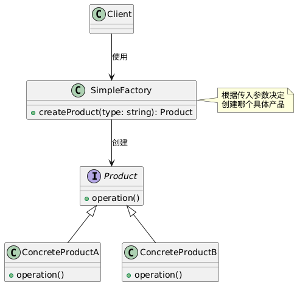


# 4. 工厂方法模式

## 简介

**工厂方法模式(Factory Method Pattern)** 是 GoF 23 种经典设计模式之一, 属于 **创建型模式**。

> 它定义一个用于创建对象的**接口(工厂方法)**, 但让**子类决定实例化哪一个类**。工厂方法使一个类的实例化延迟到其子类。

📌 核心思想: **“我不直接创建产品, 我提供一个创建方法, 让子类去实现具体创建逻辑。”**

> 💡 类比: 框架说“你必须提供一个造按钮的方法”, 具体是造 Windows 按钮还是 Mac 按钮, 由子类决定。

与“简单工厂”不同, 工厂方法模式通过**继承 + 多态**实现扩展, 符合**开闭原则**。

**适用场景**

1. **不确定对象创建细节, 希望子类决定** —— 如框架提供接口, 用户实现具体产品。
2. **需要将产品创建与使用解耦** —— 客户端只依赖抽象产品和创建者。
3. **希望支持扩展新产品, 而不修改现有代码** —— 符合开闭原则。
4. **并行产品族结构** —— 如不同平台、不同数据库、不同文件格式的创建。

📌 常见应用: 

- 跨平台 UI 控件(Qt、MFC 等框架)
- 数据库连接工厂(MySQLFactory、PostgreSQLFactory)
- 游戏关卡生成器(EasyLevelFactory、HardLevelFactory)
- 日志记录器(FileLoggerFactory、DBLoggerFactory)
- 插件系统(每个插件提供自己的工厂)

**优缺点**

**✅ 优点**

- **符合开闭原则** —— 新增产品只需新增具体工厂和产品类, 无需修改现有代码。
- **符合单一职责原则** —— 创建逻辑封装在工厂子类中。
- **客户端与具体产品解耦** —— 只依赖抽象接口。
- **支持并行产品族结构** —— 易于组织相关产品。
- **便于单元测试** —— 可轻松 Mock 工厂方法。

**❌ 缺点**

- **类数量增加** —— 每个产品对应一个工厂子类(有时显得“类爆炸”)。
- **结构略复杂** —— 相比“简单工厂”, 多了一层继承结构。
- **客户端需知道具体工厂类** —— 仍需 `new WindowsDialog()`, 可通过“抽象工厂”或配置进一步解耦。

**⚠️ 注意事项**

1. **工厂方法通常为虚函数** —— C++ 中用 `virtual` 标记, 允许子类重写。
2. **返回智能指针管理资源** —— 示例中使用 `std::unique_ptr` 避免内存泄漏。
3. **可结合模板简化(模板工厂方法)** —— 若产品构造简单, 可用 CRTP: 

📌 **一句话总结: **

> **工厂方法 = “我定义创建接口, 你(子类)决定创建谁”, 实现灵活扩展, 拥抱变化。**

## 代码

```
// Shape.h
#include <iostream>
#include <memory>

// 抽象产品
class Shape {
public:
    virtual ~Shape() = default;
    virtual void draw() = 0;
};

// 具体产品: 圆形
class Circle : public Shape {
public:
    void draw() override {
        std::cout << "Drawing a Circle" << std::endl;
    }
};

// 具体产品: 矩形
class Rectangle : public Shape {
public:
    void draw() override {
        std::cout << "Drawing a Rectangle" << std::endl;
    }
};

// 抽象工厂
class ShapeFactory {
public:
    virtual ~ShapeFactory() = default;
    virtual std::unique_ptr<Shape> createShape() = 0; // 工厂方法
};

// 具体工厂: 圆形工厂
class CircleFactory : public ShapeFactory {
public:
    std::unique_ptr<Shape> createShape() override {
        return std::make_unique<Circle>();
    }
};

// 具体工厂: 矩形工厂
class RectangleFactory : public ShapeFactory {
public:
    std::unique_ptr<Shape> createShape() override {
        return std::make_unique<Rectangle>();
    }
};

// 客户端代码
void clientCode(std::unique_ptr<ShapeFactory> factory) {
    auto shape = factory->createShape();
    shape->draw();
}

// main.cpp
#include "Shape.h"

int main() {
    std::cout << "Client: Testing with CircleFactory:\n";
    clientCode(std::make_unique<CircleFactory>());

    std::cout << "\nClient: Testing with RectangleFactory:\n";
    clientCode(std::make_unique<RectangleFactory>());

    return 0;
}
```

## PlantUML

```
@startuml
' 抽象产品
abstract class Shape {
    +draw() : void
}

' 具体产品
class Circle {
    +draw() : void
}

class Rectangle {
    +draw() : void
}

' 抽象工厂
abstract class ShapeFactory {
    +createShape() : std::unique_ptr<Shape>
}

' 具体工厂
class CircleFactory {
    +createShape() : std::unique_ptr<Shape>
}

class RectangleFactory {
    +createShape() : std::unique_ptr<Shape>
}

' 关系
Shape <|-- Circle
Shape <|-- Rectangle

ShapeFactory <|-- CircleFactory
ShapeFactory <|-- RectangleFactory

CircleFactory ..> Circle : creates
RectangleFactory ..> Rectangle : creates

note right of ShapeFactory
    Factory Method
    declares interface
end note

note right of CircleFactory
    overrides to
    create Circle
end note

@enduml
```

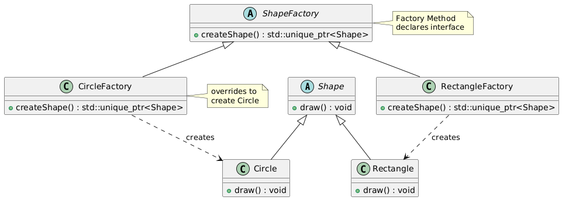


# 5. 抽象工厂模式

## 简介

**抽象工厂模式(Abstract Factory Pattern)** 是 GoF 23 种经典设计模式之一, 属于 **创建型模式**。

> 它提供一个**创建一系列相关或相互依赖对象的接口**, 而无需指定它们具体的类。

📌 核心思想: **“不是造一个产品, 而是造一整套风格一致的产品族。”**

> 💡 类比: 买家具 —— 你选“北欧风格”, 工厂就给你造北欧的沙发+椅子+桌子; 选“工业风”, 就全换成工业风。你不用一个个指定, 工厂打包给你。

抽象工厂是 **工厂方法模式的扩展** —— 工厂方法针对“单一产品”, 抽象工厂针对“产品族”。

**适用场景**

1. **系统需要独立于产品的创建、组合和表示时。**
2. **系统需要由多个产品系列中的一个来配置时。**
3. **强调一系列相关产品对象的设计以便进行联合使用。**
4. **提供一个产品类库, 而只想显示它们的接口, 而不是实现时。**

📌 **典型应用场景: **

- GUI 跨平台组件库(Windows vs Mac vs Linux 风格控件)
- 游戏中不同主题的装备套装(战士套装、法师套装)
- 数据库访问层(MySQLFactory、PostgreSQLFactory 创建 Connection、Command、DataReader)

**✅ 三、优缺点**

**✅ 优点: **

1. **分离具体类的生成, 客户端不依赖具体类。**
2. **易于交换产品系列** —— 只需更换 ConcreteFactory。
3. **有利于产品一致性** —— 确保创建的对象是配套的、兼容的。
4. **符合开闭原则(对扩展开放)** —— 增加新产品族时只需新增工厂和产品类。

**❌ 缺点: **

1. **难以支持新种类的产品** —— 如果要新增一类产品(如新增 TextBox), 需要修改所有工厂接口及其实现。
2. **类数量爆炸** —— 每个产品族 × 每个产品类型 = 大量类。
3. **结构复杂, 小项目不推荐。**

> 💡 抽象工厂适合“产品族稳定、产品类型少、族多”的场景。

**✅ 注意事项**

1. **抽象工厂接口应稳定, 避免频繁增删产品类型。**
2. **C++ 中推荐返回智能指针(`std::unique_ptr`)管理资源。**
3. **工厂通常不持有状态, 可设计为单例或静态工厂。**
4. **避免在工厂中做复杂初始化逻辑, 保持职责单一。**
5. **如果产品类型可能扩展, 可考虑结合“反射”或“注册机制”动态支持。**

📌 **一句话总结: **

> **抽象工厂 = “我给你一套配套产品, 你无需关心它们从哪来, 只需用就对了”。**

## 代码

```
// GUIFactory.h
#include <iostream>
#include <memory>
#include <string>

// 抽象产品: 按钮
class Button {
public:
    virtual ~Button() = default;
    virtual void paint() = 0;
};

// 抽象产品: 复选框
class Checkbox {
public:
    virtual ~Checkbox() = default;
    virtual void paint() = 0;
};

// 抽象工厂
class GUIFactory {
public:
    virtual ~GUIFactory() = default;
    virtual std::unique_ptr<Button> createButton() = 0;
    virtual std::unique_ptr<Checkbox> createCheckbox() = 0;
};

// ==================== Windows 平台产品 ====================

class WinButton : public Button {
public:
    void paint() override {
        std::cout << "Render a button in Windows style." << std::endl;
    }
};

class WinCheckbox : public Checkbox {
public:
    void paint() override {
        std::cout << "Render a checkbox in Windows style." << std::endl;
    }
};

class WinFactory : public GUIFactory {
public:
    std::unique_ptr<Button> createButton() override {
        return std::make_unique<WinButton>();
    }

    std::unique_ptr<Checkbox> createCheckbox() override {
        return std::make_unique<WinCheckbox>();
    }
};

// ==================== Mac 平台产品 ====================

class MacButton : public Button {
public:
    void paint() override {
        std::cout << "Render a button in Mac style." << std::endl;
    }
};

class MacCheckbox : public Checkbox {
public:
    void paint() override {
        std::cout << "Render a checkbox in Mac style." << std::endl;
    }
};

class MacFactory : public GUIFactory {
public:
    std::unique_ptr<Button> createButton() override {
        return std::make_unique<MacButton>();
    }

    std::unique_ptr<Checkbox> createCheckbox() override {
        return std::make_unique<MacCheckbox>();
    }
};

// ==================== 客户端代码 ====================

void clientCode(std::unique_ptr<GUIFactory> factory) {
    auto button = factory->createButton();
    auto checkbox = factory->createCheckbox();

    button->paint();
    checkbox->paint();
}

// main.cpp
#include "GUIFactory.h"

int main() {
    std::cout << "Client: Testing client code with Windows factory:\n";
    clientCode(std::make_unique<WinFactory>());

    std::cout << "\nClient: Testing client code with Mac factory:\n";
    clientCode(std::make_unique<MacFactory>());

    return 0;
}
```

## PlantUML

```
@startuml

' ================= 抽象层 =================
abstract class GUIFactory {
    +createButton() : std::unique_ptr<Button>
    +createCheckbox() : std::unique_ptr<Checkbox>
}

abstract class Button {
    +paint() : void
}

abstract class Checkbox {
    +paint() : void
}

' ================= Windows 产品族 =================
class WinFactory {
    +createButton() : std::unique_ptr<Button>
    +createCheckbox() : std::unique_ptr<Checkbox>
}

class WinButton {
    +paint() : void
}

class WinCheckbox {
    +paint() : void
}

' ================= Mac 产品族 =================
class MacFactory {
    +createButton() : std::unique_ptr<Button>
    +createCheckbox() : std::unique_ptr<Checkbox>
}

class MacButton {
    +paint() : void
}

class MacCheckbox {
    +paint() : void
}

' ================= 继承关系 =================
GUIFactory <|-- WinFactory
GUIFactory <|-- MacFactory

Button <|-- WinButton
Button <|-- MacButton

Checkbox <|-- WinCheckbox
Checkbox <|-- MacCheckbox

' ================= 创建关系 =================
WinFactory ..> WinButton : creates
WinFactory ..> WinCheckbox : creates

MacFactory ..> MacButton : creates
MacFactory ..> MacCheckbox : creates

note right of GUIFactory
    Abstract Factory
    creates a family of products
end note

note right of WinFactory
    Concrete Factory for Windows
end note

@enduml
```


# 6. 单例模式

## 简介

> **单例模式(Singleton Pattern)** 是一种创建型设计模式, 它确保一个类**只有一个实例**, 并提供一个**全局访问点**来访问该实例。

**核心思想: **

- **私有化构造函数** → 防止外部 `new`
- **静态成员变量** → 存储唯一实例
- **静态成员函数** → 提供全局访问接口(如 `getInstance()`

**适用场景**

1. **需要全局唯一访问点的对象**, 如: 
   - 配置管理器(ConfigManager)
   - 日志记录器(Logger)
   - 数据库连接池(ConnectionPool)
   - 线程池(ThreadPool)
   - 应用程序上下文(ApplicationContext)
2. **资源需要共享且控制访问数量时**(如许可证、硬件设备驱动)。
3. **避免频繁创建销毁开销大的对象**。

📌 **典型应用场景: **

- 游戏中的“游戏管理器”
- 系统中的“设置中心”
- 多线程环境中的“全局状态管理”

**优缺点**

**✅ 优点: **

1. **确保全局唯一实例, 节省资源。**
2. **提供全局访问点, 使用方便。**
3. **延迟初始化(Lazy Initialization)—— 首次使用才创建。**
4. **可继承扩展(受限, 但可通过模板或依赖注入优化)。**

**❌ 缺点: **

1. **违反单一职责原则** —— 既要管理实例, 又要处理业务逻辑。
2. **隐藏依赖关系** —— 不利于单元测试(Mock 困难)。
3. **多线程环境下需考虑线程安全**(C++11 后可简化)。
4. **生命周期管理困难** —— 何时销毁？谁来销毁？
5. **可能造成“全局状态污染”**, 导致代码耦合度高。

> 💡 现代 C++ 项目中, 单例应谨慎使用, 优先考虑依赖注入(DI)或服务定位器(Service Locator)。

**注意事项(非常重要！)**

1. 🚨 线程安全(Thread Safety)

2. 🚫 禁止拷贝和赋值
3. 🕒 析构顺序问题(“静态析构顺序惨案”)
4. 单元测试困难

**📌 一句话总结: **

> **单例模式 = “我保证全局只有一个我, 谁要用, 找我拿”。**

## 代码

```
// Singleton.h
#pragma once
#include <iostream>

class Singleton {
private:
    // 私有构造
    Singleton() {
        std::cout << "Singleton created!" << std::endl;
    }

    // 禁止拷贝
    Singleton(const Singleton&) = delete;
    Singleton& operator=(const Singleton&) = delete;

public:
    // C++11 Magic Static: 线程安全 + 延迟初始化 + 自动析构
    static Singleton& getInstance() {
        static Singleton instance;
        return instance;
    }

    void doSomething() {
        std::cout << "Doing something..." << std::endl;
    }

    ~Singleton() {
        std::cout << "Singleton destroyed!" << std::endl;
    }
};

// main.cpp
#include "Singleton.h"

int main() {
    auto& s1 = Singleton::getInstance();
    s1.doSomething();

    auto& s2 = Singleton::getInstance();
    std::cout << (&s1 == &s2 ? "Same instance!" : "Different!") << std::endl;

    return 0;
}
```

## PlantUML

```
@startuml

class Singleton {
    -{static} instance : Singleton*
    -Singleton()
    +{static} getInstance() : Singleton&
    +doSomething() : void
    -{delete} Singleton(const Singleton&)
    -{delete} operator=(const Singleton&)
}

note right of Singleton::getInstance
    C++11 Magic Static:
    - Thread-safe
    - Lazy initialization
    - Auto destruction
end note

note bottom of Singleton
    Ensures only one instance exists
    and provides global access point.
end note

@enduml
```

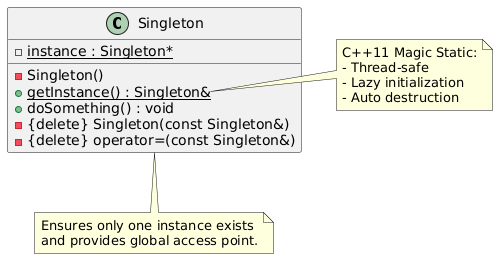

# 7. 建造者模式

## 简介

> **建造者模式(Builder Pattern)** 是一种创建型设计模式, 它将一个**复杂对象的构建过程与其表示分离**, 使得同样的构建过程可以创建不同的表示。

🎯 核心思想: 

- 将对象的**构造过程分解为多个步骤**(如 setPartA, setPartB, setPartC…)
- 使用一个“导演”(Director)控制构建流程(可选)
- 最终返回完整构建好的对象

> 💡 适用于: 对象构造复杂、参数多、构造步骤多、需要灵活组合不同部分。

🧩 **结构组成**: 

| 角色              | 说明                                             |
| ----------------- | ------------------------------------------------ |
| `Product`         | 被构建的复杂对象(如汽车、SQL查询、HTML文档)    |
| `Builder`         | 抽象建造者, 定义构建各部分的接口                 |
| `ConcreteBuilder` | 具体建造者, 实现构建步骤, 提供获取最终产品的接口 |
| `Director`        | (可选)指导构建过程, 封装构建流程               |

✅**适用场景**

1. **创建复杂对象, 其构造过程包含多个步骤或部件。**
2. **构造过程必须允许构造不同的表示(如不同配置的汽车、不同风格的文档)。**
3. **对象的构造算法应独立于组成部分和装配方式。**
4. **构造过程需要被复用或标准化(如“标准套餐”、“豪华套餐”)。**

📌 **典型应用场景: **

- 构建 SQL 查询语句(SELECT, FROM, WHERE, GROUP BY…)
- 构建 HTML / XML 文档
- 游戏角色创建(不同装备、属性组合)
- 汽车/电脑配置器(选配 CPU、内存、硬盘…)
- 流式 API(如 std::ostringstream, Qt 的信号槽连接器)

**优缺点**

**✅ 优点: **

1. **分离构造与表示** → 同一构建过程可创建不同产品。
2. **更精细控制构造过程** → 可跳过、重复、条件化某些步骤。
3. **代码可读性高** → 步骤清晰, 易于维护。
4. **支持 Fluent Interface(流式调用)** → 提升 API 体验。
5. **符合开闭原则** → 新增 Builder 不影响原有代码。

**❌ 缺点: **

1. **类数量增加** → 每个产品变体可能需要一个 Builder。
2. **结构略复杂** → 小项目或简单对象不推荐使用。
3. **Director 非必需** → 有时客户端直接调用 Builder 更灵活。

✅**注意事项**

1. **Builder 通常不持有最终产品状态, 而是逐步构建。**
2. **最终产品应提供“获取结果”方法(如 `getProduct()`)。**
3. **可选: 提供“重置”方法, 以便 Builder 重用。**
4. **C++ 中推荐返回 `std::unique_ptr` 或值对象, 避免裸指针。**
5. **支持 Fluent Interface 时, 每个 setter 返回 `\*this`。**
6. **线程安全: Builder 通常非线程安全, 应避免共享。**

> **记忆口诀: **
>
> - **工厂 → “给你一个成品”**
> - **建造者 → “一步步帮你搭出来”**

📌 **终极建议: **

> **现代 C++ 中, 优先考虑 Fluent Builder(流式接口), 它更直观、更易用、更符合直觉。Director 可选, 客户端直接调用 Builder 往往更灵活。**


## 代码

```
// Computer.h
#include <iostream>
#include <string>
#include <memory>

// 产品类: 计算机
class Computer {
private:
    std::string cpu;
    std::string ram;
    std::string storage;
    bool hasGPU = false;
    bool hasSSD = false;

public:
    // 设置器(可选, Builder 也可直接访问私有成员, 或设为 friend)
    void setCPU(const std::string& c) { cpu = c; }
    void setRAM(const std::string& r) { ram = r; }
    void setStorage(const std::string& s) { storage = s; }
    void setGPU(bool g) { hasGPU = g; }
    void setSSD(bool s) { hasSSD = s; }

    void show() const {
        std::cout << "=== Computer Configuration ===\n";
        std::cout << "CPU: " << cpu << "\n";
        std::cout << "RAM: " << ram << "\n";
        std::cout << "Storage: " << storage << "\n";
        std::cout << "GPU: " << (hasGPU ? "Yes" : "No") << "\n";
        std::cout << "SSD: " << (hasSSD ? "Yes" : "No") << "\n";
        std::cout << "=============================\n\n";
    }
};

// 抽象建造者
class ComputerBuilder {
public:
    virtual ~ComputerBuilder() = default;
    virtual void buildCPU() = 0;
    virtual void buildRAM() = 0;
    virtual void buildStorage() = 0;
    virtual void buildGPU() = 0;
    virtual void buildSSD() = 0;
    virtual std::unique_ptr<Computer> getComputer() = 0;
};

// 具体建造者: 游戏电脑
class GamingComputerBuilder : public ComputerBuilder {
private:
    std::unique_ptr<Computer> computer;

public:
    GamingComputerBuilder() {
        computer = std::make_unique<Computer>();
    }

    void buildCPU() override {
        computer->setCPU("Intel i9-13900K");
    }

    void buildRAM() override {
        computer->setRAM("32GB DDR5");
    }

    void buildStorage() override {
        computer->setStorage("2TB NVMe");
    }

    void buildGPU() override {
        computer->setGPU(true);
    }

    void buildSSD() override {
        computer->setSSD(true);
    }

    std::unique_ptr<Computer> getComputer() override {
        return std::move(computer);
    }
};

// 具体建造者: 办公电脑
class OfficeComputerBuilder : public ComputerBuilder {
private:
    std::unique_ptr<Computer> computer;

public:
    OfficeComputerBuilder() {
        computer = std::make_unique<Computer>();
    }

    void buildCPU() override {
        computer->setCPU("Intel i5-13400");
    }

    void buildRAM() override {
        computer->setRAM("16GB DDR4");
    }

    void buildStorage() override {
        computer->setStorage("512GB SSD");
    }

    void buildGPU() override {
        computer->setGPU(false);
    }

    void buildSSD() override {
        computer->setSSD(true);
    }

    std::unique_ptr<Computer> getComputer() override {
        return std::move(computer);
    }
};

// 导演类(可选): 封装构建流程
class ComputerDirector {
public:
    static void constructGamingComputer(ComputerBuilder& builder) {
        builder.buildCPU();
        builder.buildRAM();
        builder.buildStorage();
        builder.buildGPU();
        builder.buildSSD();
    }

    static void constructOfficeComputer(ComputerBuilder& builder) {
        builder.buildCPU();
        builder.buildRAM();
        builder.buildStorage();
        builder.buildSSD();
        // 不装独立显卡
    }
};

// 客户端代码
#include "Computer.h"

int main() {
    // 方式1: 使用 Director
    std::cout << "=== Using Director ===\n";
    GamingComputerBuilder gamingBuilder;
    ComputerDirector::constructGamingComputer(gamingBuilder);
    auto gamingPC = gamingBuilder.getComputer();
    gamingPC->show();

    // 方式2: 客户端直接控制构建步骤(更灵活)
    std::cout << "=== Manual Building ===\n";
    OfficeComputerBuilder officeBuilder;
    officeBuilder.buildCPU();
    officeBuilder.buildRAM();
    officeBuilder.buildStorage();
    officeBuilder.buildSSD();
    // 跳过 buildGPU()
    auto officePC = officeBuilder.getComputer();
    officePC->show();

    return 0;
}
```

✅ 进阶: Fluent Builder(流式接口)

```
class FluentComputerBuilder {
private:
    std::unique_ptr<Computer> computer;

public:
    FluentComputerBuilder() : computer(std::make_unique<Computer>()) {}

    FluentComputerBuilder& withCPU(const std::string& cpu) {
        computer->setCPU(cpu);
        return *this; // 返回自身, 支持链式调用
    }

    FluentComputerBuilder& withRAM(const std::string& ram) {
        computer->setRAM(ram);
        return *this;
    }

    FluentComputerBuilder& withStorage(const std::string& storage) {
        computer->setStorage(storage);
        return *this;
    }

    FluentComputerBuilder& withGPU() {
        computer->setGPU(true);
        return *this;
    }

    std::unique_ptr<Computer> build() {
        return std::move(computer);
    }
};

// 使用方式: 
auto customPC = FluentComputerBuilder()
    .withCPU("AMD Ryzen 9")
    .withRAM("64GB DDR5")
    .withStorage("4TB SSD")
    .withGPU()
    .build();

customPC->show();
```

## PlantUML

```
@startuml

' 产品
class Computer {
    -cpu: string
    -ram: string
    -storage: string
    -hasGPU: bool
    -hasSSD: bool
    +setCPU(cpu: string)
    +setRAM(ram: string)
    +setStorage(storage: string)
    +setGPU(gpu: bool)
    +setSSD(ssd: bool)
    +show() : void
}

' 抽象建造者
abstract class ComputerBuilder {
    +buildCPU() : void
    +buildRAM() : void
    +buildStorage() : void
    +buildGPU() : void
    +buildSSD() : void
    +getComputer() : std::unique_ptr<Computer>
}

' 具体建造者
class GamingComputerBuilder {
    -computer: std::unique_ptr<Computer>
    +buildCPU()
    +buildRAM()
    +buildStorage()
    +buildGPU()
    +buildSSD()
    +getComputer() : std::unique_ptr<Computer>
}

class OfficeComputerBuilder {
    -computer: std::unique_ptr<Computer>
    +buildCPU()
    +buildRAM()
    +buildStorage()
    +buildGPU()
    +buildSSD()
    +getComputer() : std::unique_ptr<Computer>
}

' 导演(可选)
class ComputerDirector {
    +{static} constructGamingComputer(builder: ComputerBuilder&)
    +{static} constructOfficeComputer(builder: ComputerBuilder&)
}

' 关系
ComputerBuilder <|-- GamingComputerBuilder
ComputerBuilder <|-- OfficeComputerBuilder

GamingComputerBuilder ..> Computer : builds
OfficeComputerBuilder ..> Computer : builds

ComputerDirector ..> ComputerBuilder : uses

note right of ComputerBuilder
    Defines steps to build
    a Computer.
end note

note bottom of ComputerDirector
    Optional: Encapsulates
    common build sequences.
end note

@enduml
```

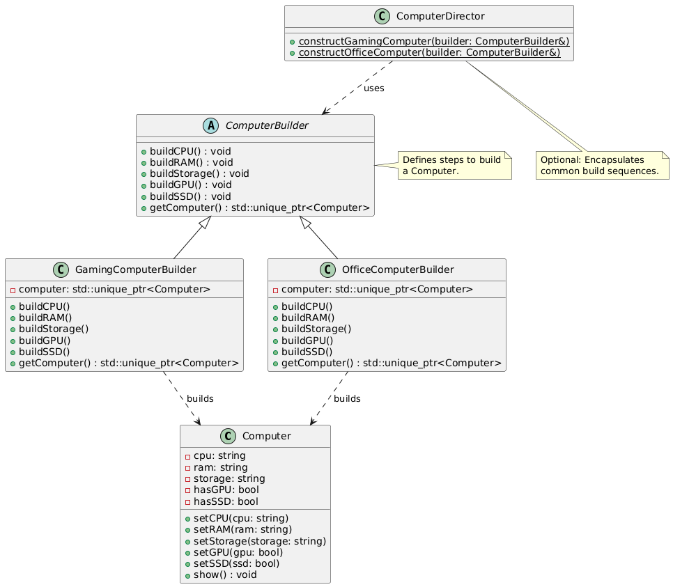

# 8. 原型模式

## 简介

> **原型模式(Prototype Pattern)** 是一种创建型设计模式, 它通过**复制现有对象(原型)** 来创建新对象, 而不是通过 `new` 调用构造函数。

🎯 **核心思想: **

- **“克隆”代替“构造”**
- 定义一个 `clone()` 接口, 由子类实现具体的复制逻辑
- 客户端不关心对象创建细节, 只需复制原型即可

> 💡 适用于: 对象创建成本高、结构复杂、或需动态配置对象时。

🧩 **结构组成: **

| 角色                | 说明                             |
| ------------------- | -------------------------------- |
| `Prototype`         | 声明克隆接口(如 `clone()`)     |
| `ConcretePrototype` | 实现克隆方法, 返回自身副本       |
| `Client`            | 持有原型对象, 通过克隆创建新对象 |

✅**适用场景**

1. **对象创建成本高(如需从数据库/网络加载、复杂初始化)**
2. **系统需独立于对象的创建、组合和表示**
3. **运行时动态决定创建对象的种类(通过配置原型池)**
4. **避免构建类层次的工厂(用克隆代替工厂)**
5. **需要“对象模板”功能(如游戏中的怪物模板、文档模板)**

📌 **典型应用场景: **

- 游戏中大量相同怪物/道具的生成(克隆模板)
- 图形编辑器中复制复杂图形对象
- 配置管理系统中复制预设配置对象
- 复杂对象初始化后作为“默认模板”供后续复制

✅ **优缺点**

✅ 优点: 

1. **隐藏创建细节** → 客户端无需知道具体类。
2. **性能优化** → 避免重复昂贵初始化。
3. **支持动态配置** → 运行时替换原型对象。
4. **简化对象创建** → 无需对应每个类写工厂。
5. **可结合“原型注册表”实现配置化创建。**

❌ 缺点: 

1. **必须实现克隆方法** → 每个子类都要写 `clone()`。
2. **深拷贝实现复杂** → 涉及指针、资源管理时容易出错。
3. **破坏封装性** → 克隆可能需访问私有成员(可声明为 `friend` 或提供复制构造)。
4. **对“不可变对象”无意义** → 如全是 `const` 成员。

✅ **注意事项(非常重要！)**

1. 🚨 深拷贝 vs 浅拷贝(C++ 核心问题！)

- **浅拷贝(默认)**: 只复制指针值 → 多个对象共享同一块内存 → 危险！
- **深拷贝**: 复制指针指向的内容 → 独立副本 → 安全！

✅ **必须手动实现深拷贝**, 或使用智能指针 + 自定义克隆。

2. 📌 实现 `clone()` 的常见方式: 

方式1: 纯虚函数 + 子类 override(推荐)

方式2: 使用复制构造函数(需暴露或声明为 friend)

3. 🧩 资源管理建议: 

- 使用 `std::unique_ptr` / `std::shared_ptr` 管理动态资源
- 若含裸指针, 必须在 `clone()` 中手动 `new` + 深拷贝
- 考虑使用“复制构造函数 + 赋值操作符”实现 RAII

4. 🧪 可结合“原型注册表”实现动态创建

​	std::map<std::string, std::unique_ptr<Prototype>> prototypeRegistry;

​	客户端通过 key 获取原型并克隆, 实现“配置化对象创建”。

📌 **终极建议: **

> **现代 C++ 中, 若对象不含裸指针或复杂资源, 使用默认复制构造即可; 若含资源, 优先使用智能指针或容器, 避免手动管理内存。原型模式在游戏开发、图形编辑器、配置系统中非常实用！**

掌握原型模式, 你就能高效“克隆”对象, 避免重复初始化开销, 提升系统性能和灵活性！

## 代码

```
// Prototype.h
#include <iostream>
#include <string>
#include <memory>
#include <unordered_map>

// 抽象原型
class EnemyPrototype {
public:
    virtual ~EnemyPrototype() = default;

    // 纯虚克隆函数
    virtual std::unique_ptr<EnemyPrototype> clone() const = 0;

    // 业务方法
    virtual void showInfo() const = 0;
    virtual void fight() const = 0;
};

// 具体原型: 哥布林
class Goblin : public EnemyPrototype {
private:
    std::string name;
    int health;
    int damage;

public:
    Goblin(const std::string& n = "Goblin", int h = 50, int d = 10)
        : name(n), health(h), damage(d) {}

    // 实现深拷贝克隆
    std::unique_ptr<EnemyPrototype> clone() const override {
        return std::make_unique<Goblin>(*this); // 调用复制构造(默认即可, 无指针)
    }

    void showInfo() const override {
        std::cout << "[Goblin] Name: " << name << ", Health: " << health << ", Damage: " << damage << std::endl;
    }

    void fight() const override {
        std::cout << name << " attacks with " << damage << " damage!" << std::endl;
    }

    // 可选: 提供修改方法用于配置模板
    void setHealth(int h) { health = h; }
    void setDamage(int d) { damage = d; }
    void setName(const std::string& n) { name = n; }
};

// 具体原型: 巨魔
class Troll : public EnemyPrototype {
private:
    std::string name;
    int health;
    int damage;
    bool regenerates;

public:
    Troll(const std::string& n = "Troll", int h = 100, int d = 20, bool regen = true)
        : name(n), health(h), damage(d), regenerates(regen) {}

    std::unique_ptr<EnemyPrototype> clone() const override {
        return std::make_unique<Troll>(*this);
    }

    void showInfo() const override {
        std::cout << "[Troll] Name: " << name << ", Health: " << health
                  << ", Damage: " << damage << ", Regen: " << (regenerates ? "Yes" : "No") << std::endl;
    }

    void fight() const override {
        std::cout << name << " smashes for " << damage << " damage!" << std::endl;
        if (regenerates) std::cout << name << " starts regenerating health!\n";
    }
};

// 原型管理器(注册表)
class EnemyPrototypeManager {
private:
    std::unordered_map<std::string, std::unique_ptr<EnemyPrototype>> prototypes;

public:
    void registerPrototype(const std::string& key, std::unique_ptr<EnemyPrototype> prototype) {
        prototypes[key] = std::move(prototype);
    }

    std::unique_ptr<EnemyPrototype> create(const std::string& key) const {
        auto it = prototypes.find(key);
        if (it != prototypes.end() && it->second) {
            return it->second->clone();
        }
        throw std::runtime_error("Prototype not found: " + key);
    }
};

// main.cpp
#include "Prototype.h"

int main() {
    // 创建原型模板
    auto goblinTemplate = std::make_unique<Goblin>("Green Goblin", 60, 15);
    auto trollTemplate = std::make_unique<Troll>("Cave Troll", 120, 25, true);

    // 注册到管理器
    EnemyPrototypeManager manager;
    manager.registerPrototype("goblin", std::move(goblinTemplate));
    manager.registerPrototype("troll", std::move(trollTemplate));

    // 通过克隆创建新对象
    std::cout << "=== Creating enemies via Prototype ===\n";
    auto enemy1 = manager.create("goblin");
    auto enemy2 = manager.create("troll");
    auto enemy3 = manager.create("goblin"); // 再克隆一个哥布林

    enemy1->showInfo();
    enemy1->fight();

    enemy2->showInfo();
    enemy2->fight();

    enemy3->showInfo();
    enemy3->fight();

    return 0;
}
```

✅ 含指针成员的深拷贝示例(重要！)

```
class DeepCopyExample : public EnemyPrototype {
private:
    std::string* name; // 假设用裸指针(实际推荐用 std::string)
    int health;

public:
    DeepCopyExample(const std::string& n = "Default", int h = 100) 
        : health(h) {
        name = new std::string(n);
    }

    // 深拷贝复制构造
    DeepCopyExample(const DeepCopyExample& other)
        : health(other.health) {
        name = new std::string(*other.name); // 深拷贝！
    }

    // 必须重载赋值操作符(Rule of Three)
    DeepCopyExample& operator=(const DeepCopyExample& other) {
        if (this != &other) {
            delete name;
            name = new std::string(*other.name);
            health = other.health;
        }
        return *this;
    }

    ~DeepCopyExample() {
        delete name;
    }

    std::unique_ptr<EnemyPrototype> clone() const override {
        return std::make_unique<DeepCopyExample>(*this); // 调用复制构造
    }

    void showInfo() const override {
        std::cout << "Name: " << *name << ", Health: " << health << std::endl;
    }

    void fight() const override {
        std::cout << *name << " fights!\n";
    }
};
```

## PlantUML

```
@startuml

' 抽象原型
abstract class EnemyPrototype {
    +clone() : std::unique_ptr<EnemyPrototype>
    +showInfo() : void
    +fight() : void
}

' 具体原型
class Goblin {
    -name: string
    -health: int
    -damage: int
    +clone() : std::unique_ptr<EnemyPrototype>
    +showInfo() : void
    +fight() : void
    +setHealth(h: int)
    +setDamage(d: int)
}

class Troll {
    -name: string
    -health: int
    -damage: int
    -regenerates: bool
    +clone() : std::unique_ptr<EnemyPrototype>
    +showInfo() : void
    +fight() : void
}

' 原型管理器
class EnemyPrototypeManager {
    -prototypes: map<string, unique_ptr<EnemyPrototype>>
    +registerPrototype(key: string, prototype: unique_ptr<EnemyPrototype>)
    +create(key: string) : unique_ptr<EnemyPrototype>
}

' 关系
EnemyPrototype <|-- Goblin
EnemyPrototype <|-- Troll

EnemyPrototypeManager o-- EnemyPrototype : holds prototypes

note right of EnemyPrototype::clone
    Pure virtual function
    Subclasses implement
    deep copy logic.
end note

note bottom of EnemyPrototypeManager
    Optional registry for
    dynamic prototype access.
end note

@enduml
```

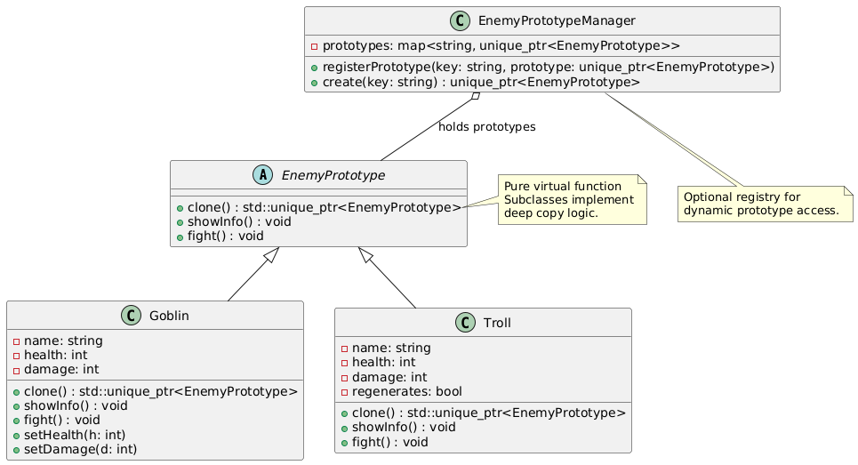

# 🔌结构型模式

# 9. 适配器模式

## 简介

> **适配器模式(Adapter Pattern)** 是一种结构型设计模式, 它**将一个类的接口转换成客户期望的另一个接口**, 使得原本由于接口不兼容而不能一起工作的类可以协同工作。

🎯 **核心思想: **

- **“接口转换器”** —— 像电源适配器一样, 把“不匹配的插头”变成“匹配的插头”
- 解决“老接口”与“新需求”之间的不兼容问题
- 不修改原有类, 通过“包装”实现接口转换

> 💡 适用于: 集成第三方库、旧系统改造、接口标准化等场景。

🧩 **结构组成: **

| 角色      | 说明                                            |
| --------- | ----------------------------------------------- |
| `Target`  | 客户端期望的接口(抽象类或接口)                |
| `Adaptee` | 已存在的、但接口不兼容的类(“被适配者”)        |
| `Adapter` | 适配器, 继承/组合 `Adaptee`, 实现 `Target` 接口 |

✅ **适用场景**

1. **使用现有类, 但其接口不符合需求。**
2. **想复用一些现存的类, 但无法修改其源码(如第三方库)。**
3. **创建一个可复用的类, 与其他不相关或不可预见的类协同工作。**
4. **系统数据/接口升级, 需要兼容旧版本接口。**

📌 **典型应用场景: **

- 将旧版日志接口适配到新版统一日志系统
- 将第三方支付 SDK(如支付宝、微信)统一成内部支付接口
- 将不同图形库(OpenGL/DirectX)统一成引擎渲染接口
- 将 C 风格 API 适配成 C++ RAII 接口
- 游戏中不同输入设备(键盘、手柄、触屏)统一成“输入事件”

✅ **优缺点**

✅ 优点: 

1. **提高类的复用性** → 不修改原有代码即可集成。
2. **增强类的透明性和复用性** → 客户端只与 Target 接口交互。
3. **灵活性高** → 可同时适配多个 Adaptee。
4. **符合开闭原则** → 对扩展开放, 对修改关闭。

❌ 缺点: 

1. **增加系统复杂度** → 引入额外的适配器类。
2. **过多适配器会让系统“绕来绕去”** → 调试困难。
3. **性能略有损失** → 多一层调用(通常可忽略)。

✅ **注意事项**

1. 🔄 两种实现方式: 

| 方式           | 说明                         | 优点                 | 缺点                     |
| -------------- | ---------------------------- | -------------------- | ------------------------ |
| **类适配器**   | 通过多重继承实现(C++ 支持) | 效率高, 直接继承     | 不灵活, C++ 多重继承复杂 |
| **对象适配器** | 通过组合 + 委托实现(推荐)  | 灵活, 可适配类的子类 | 多一层对象引用           |

> ✅ **现代 C++ 推荐使用“对象适配器”** —— 更灵活、更安全、更符合组合优于继承原则。

2. ⚠️ 适配器不是万能胶水

- 适配器用于**接口转换**, 不是用于**功能增强**
- 如果两个类语义完全不相关, 强行适配会导致逻辑混乱

3. 📦 适配器可结合“工厂模式”动态选择适配对象

4. 🧩 适配器可“双向适配”

- 有时需要 A→B, 有时需要 B→A, 可设计双向适配器(较少见)

🎯 **推荐语: **

> **当你面对“祖传代码”或“第三方黑盒库”时, 适配器模式是你最好的朋友。它让你在不破坏原有系统的情况下, 优雅地集成新功能。**

掌握适配器模式, 你就能在“接口不兼容”的战场上所向披靡！

## 代码

```
// Target.h - 客户端期望的接口
#pragma once
#include <string>
#include <iostream>

// 目标接口: 统一支付接口
class IPayment {
public:
    virtual ~IPayment() = default;
    virtual bool pay(double amount, const std::string& orderId) = 0;
    virtual std::string getName() const = 0;
};

// ==============================
// Adaptee: 微信支付(第三方库, 不能改)
class WeChatPaySDK {
public:
    // 注意: 接口不兼容！参数顺序、类型、返回值都不同
    int makePayment(const std::string& tradeNo, float price) {
        std::cout << "[WeChatPay] Paying " << price << " for order " << tradeNo << std::endl;
        return 0; // 0=success
    }
};

// ==============================
// Adaptee: 支付宝(第三方库, 不能改)
class AliPaySDK {
public:
    // 接口又不一样！
    bool doPay(float money, const char* orderNum) {
        std::cout << "[AliPay] Paying " << money << " for order " << orderNum << std::endl;
        return true; // true=success
    }
};

// ==============================
// 对象适配器: 微信支付适配器(推荐方式)
class WeChatPayAdapter : public IPayment {
private:
    WeChatPaySDK wechat; // 组合

public:
    bool pay(double amount, const std::string& orderId) override {
        int result = wechat.makePayment(orderId, static_cast<float>(amount));
        return result == 0;
    }

    std::string getName() const override {
        return "WeChat Pay";
    }
};

// ==============================
// 对象适配器: 支付宝适配器
class AliPayAdapter : public IPayment {
private:
    AliPaySDK alipay; // 组合

public:
    bool pay(double amount, const std::string& orderId) override {
        bool result = alipay.doPay(static_cast<float>(amount), orderId.c_str());
        return result;
    }

    std::string getName() const override {
        return "AliPay";
    }
};

// ==============================
// 客户端代码
#include "Target.h"

class PaymentProcessor {
public:
    static void processPayment(IPayment& payment, double amount, const std::string& orderId) {
        std::cout << "Processing payment via " << payment.getName() << "...\n";
        if (payment.pay(amount, orderId)) {
            std::cout << "✅ Payment successful!\n\n";
        } else {
            std::cout << "❌ Payment failed!\n\n";
        }
    }
};

// main.cpp
int main() {
    WeChatPayAdapter wechatAdapter;
    AliPayAdapter aliAdapter;

    PaymentProcessor::processPayment(wechatAdapter, 99.9, "ORDER_12345");
    PaymentProcessor::processPayment(aliAdapter, 199.5, "ORDER_67890");

    return 0;
}
```

✅ 进阶: 带工厂的动态适配器

```
class PaymentAdapterFactory {
public:
    static std::unique_ptr<IPayment> create(const std::string& type) {
        if (type == "wechat") return std::make_unique<WeChatPayAdapter>();
        if (type == "alipay") return std::make_unique<AliPayAdapter>();
        throw std::invalid_argument("Unsupported payment type: " + type);
    }
};

// 使用: 
auto payment = PaymentAdapterFactory::create("wechat");
PaymentProcessor::processPayment(*payment, 50.0, "DYNAMIC_ORDER");
```

## PlantUML

```
@startuml

' 目标接口
interface IPayment {
    +pay(amount: double, orderId: string) : bool
    +getName() : string
}

' 被适配者(微信)
class WeChatPaySDK {
    +makePayment(tradeNo: string, price: float) : int
}

' 被适配者(支付宝)
class AliPaySDK {
    +doPay(money: float, orderNum: char*) : bool
}

' 适配器(对象适配器 - 推荐)
class WeChatPayAdapter {
    -wechat: WeChatPaySDK
    +pay(amount: double, orderId: string) : bool
    +getName() : string
}

class AliPayAdapter {
    -alipay: AliPaySDK
    +pay(amount: double, orderId: string) : bool
    +getName() : string
}

' 客户端
class PaymentProcessor {
    +{static} processPayment(payment: IPayment&, amount: double, orderId: string)
}

' 关系
WeChatPayAdapter ..|> IPayment
AliPayAdapter ..|> IPayment

WeChatPayAdapter *-- WeChatPaySDK : adapts
AliPayAdapter *-- AliPaySDK : adapts

PaymentProcessor --> IPayment : uses

note right of WeChatPayAdapter
    Object Adapter (Composition)
    Recommended in modern C++
end note

note right of AliPayAdapter
    Converts AliPaySDK interface
    to IPayment interface.
end note

@enduml
```

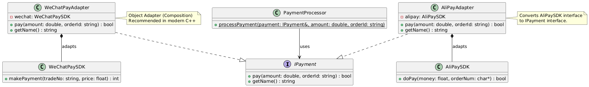

# 10. 桥接模式

## 简介

> **桥接模式(Bridge Pattern)** 是一种**结构型设计模式**, 它将**抽象部分与实现部分分离**, 使它们可以**独立变化**。

🎯 核心思想: 

- “抽象” 与 “实现” 解耦 → 用**组合代替继承**
- 抽象层持有一个“实现层”的引用(指针)
- 两者可独立扩展, 避免“类爆炸”

> 💡 桥接 = “抽象” 与 “实现” 之间的桥梁 → 动态绑定, 运行时切换实现。

📌 **经典比喻: **

> 电视(抽象)和遥控器(实现)—— 同一个遥控器可以控制不同品牌电视, 同一电视也可配不同遥控器。

🧩 结构组成: 

| 角色                  | 说明                                             |
| --------------------- | ------------------------------------------------ |
| `Abstraction`         | 抽象类, 定义高层控制接口, 持有一个 `Implementor` |
| `RefinedAbstraction`  | 扩展抽象(可选), 如不同形状、不同设备           |
| `Implementor`         | 实现接口, 定义底层操作(如绘制、驱动)           |
| `ConcreteImplementor` | 具体实现, 如 OpenGL、DirectX、Vulkan 渲染器      |

✅ 适用场景

1. **你不希望在抽象和实现之间有固定的绑定关系(继承太死板)**
2. **抽象及其实现都应可通过子类化独立扩展**
3. **对抽象的实现修改不应影响客户端代码**
4. **你想在运行时切换实现(如切换渲染后端、数据库驱动)**
5. **避免“多维度继承”导致的类爆炸(如 Shape × Color × Renderer = N×M×K 个类)**

📌 **典型应用场景: **

- 图形库: Shape(抽象) + Renderer(实现: OpenGL/DirectX/Vulkan)
- 跨平台 UI: Button(抽象) + PlatformImpl(Win/Mac/Linux)
- 数据库驱动: DAO(抽象) + DriverImpl(MySQL/PostgreSQL/SQLite)
- 游戏引擎: GameObject(抽象) + PhysicsEngine(Box2D/Bullet)
- 遥控设备: TV(抽象) + RemoteControl(红外/蓝牙/WiFi)

✅ 优缺点

✅ 优点: 

1. **分离抽象与实现** → 两者可独立扩展, 符合单一职责原则。
2. **避免类爆炸** → N 个抽象 × M 个实现 = N+M 个类, 而不是 N×M。
3. **运行时切换实现** → 灵活, 如切换图形 API、数据库后端。
4. **提高可扩展性** → 新增实现不影响抽象层, 反之亦然。
5. **隐藏实现细节** → 客户端只与抽象层交互。

❌ 缺点: 

1. **增加系统复杂度** → 引入额外层次。
2. **客户端需理解“桥接”概念** → 初学者可能困惑。
3. **仅适用于“抽象-实现”可分离的场景** → 不是万能。

🎯 **推荐语: **

> **桥接模式是解决“多维度变化”问题的利器。当你发现类在多个维度上扩展导致子类爆炸时, 桥接模式就是你的救星！**

掌握桥接模式, 你就能设计出高度灵活、易于扩展的系统架构！

## 代码

```
// Bridge.h
#include <iostream>
#include <memory>
#include <string>

// ============ 实现层 ============
// 抽象实现接口
class Renderer {
public:
    virtual ~Renderer() = default;
    virtual void render(const std::string& shapeType, const std::string& info) = 0;
};

// 具体实现: OpenGL
class OpenGLRenderer : public Renderer {
public:
    void render(const std::string& shapeType, const std::string& info) override {
        std::cout << "[OpenGL] Rendering " << shapeType << ": " << info << std::endl;
    }
};

// 具体实现: DirectX
class DirectXRenderer : public Renderer {
public:
    void render(const std::string& shapeType, const std::string& info) override {
        std::cout << "[DirectX] Drawing " << shapeType << " -> " << info << std::endl;
    }
};

// 具体实现: Vulkan
class VulkanRenderer : public Renderer {
public:
    void render(const std::string& shapeType, const std::string& info) override {
        std::cout << "[Vulkan] 🚀 Ultra-fast rendering of " << shapeType << " (" << info << ")" << std::endl;
    }
};

// ============ 抽象层 ============
// 抽象图形
class Shape {
protected:
    std::unique_ptr<Renderer> renderer; // 桥接核心: 组合而非继承

public:
    Shape(std::unique_ptr<Renderer> r) : renderer(std::move(r)) {}

    virtual ~Shape() = default;

    // 设置渲染器(运行时切换)
    void setRenderer(std::unique_ptr<Renderer> r) {
        renderer = std::move(r);
    }

    virtual void draw() = 0;
    virtual std::string getInfo() const = 0;
    virtual std::string getType() const = 0;
};

// 具体抽象: 圆形
class Circle : public Shape {
private:
    double radius;
    std::string position;

public:
    Circle(double r, const std::string& pos, std::unique_ptr<Renderer> r)
        : Shape(std::move(r)), radius(r), position(pos) {}

    void draw() override {
        if (renderer) {
            renderer->render(getType(), getInfo());
        }
    }

    std::string getInfo() const override {
        return "Radius=" + std::to_string(radius) + ", Pos=" + position;
    }

    std::string getType() const override {
        return "Circle";
    }
};

// 具体抽象: 矩形
class Rectangle : public Shape {
private:
    double width, height;
    std::string position;

public:
    Rectangle(double w, double h, const std::string& pos, std::unique_ptr<Renderer> r)
        : Shape(std::move(r)), width(w), height(h), position(pos) {}

    void draw() override {
        if (renderer) {
            renderer->render(getType(), getInfo());
        }
    }

    std::string getInfo() const override {
        return "W=" + std::to_string(width) + ", H=" + std::to_string(height) + ", Pos=" + position;
    }

    std::string getType() const override {
        return "Rectangle";
    }
};

// 客户端
int main() {
    std::cout << "=== 桥接模式示例: 图形 + 渲染器 ===\n\n";

    // 创建不同渲染器
    auto opengl = std::make_unique<OpenGLRenderer>();
    auto directx = std::make_unique<DirectXRenderer>();
    auto vulkan = std::make_unique<VulkanRenderer>();

    // 创建图形对象, 绑定渲染器
    Circle circle(5.0, "(10,20)", std::make_unique<OpenGLRenderer>());
    Rectangle rect(10.0, 8.0, "(30,40)", std::make_unique<DirectXRenderer>());

    // 绘制
    circle.draw();
    rect.draw();

    std::cout << "\n=== 运行时切换渲染器 ===\n";
    circle.setRenderer(std::make_unique<VulkanRenderer>());
    circle.draw();

    rect.setRenderer(std::make_unique<OpenGLRenderer>());
    rect.draw();

    return 0;
}
```

✅ 进阶: 带工厂的动态桥接

```
class RendererFactory {
public:
    static std::unique_ptr<Renderer> create(const std::string& type) {
        if (type == "opengl") return std::make_unique<OpenGLRenderer>();
        if (type == "directx") return std::make_unique<DirectXRenderer>();
        if (type == "vulkan") return std::make_unique<VulkanRenderer>();
        throw std::invalid_argument("Unknown renderer: " + type);
    }
};

// 使用: 
auto circle = std::make_unique<Circle>(5.0, "(0,0)", RendererFactory::create("vulkan"));
```

## PlantUML

```
@startuml

' 抽象实现接口
interface Renderer {
    +render(shapeType: string, info: string) : void
}

' 具体实现
class OpenGLRenderer {
    +render(shapeType: string, info: string) : void
}

class DirectXRenderer {
    +render(shapeType: string, info: string) : void
}

class VulkanRenderer {
    +render(shapeType: string, info: string) : void
}

' 抽象层
abstract class Shape {
    -renderer: unique_ptr<Renderer>
    +setRenderer(r: unique_ptr<Renderer>)
    +draw() : void {abstract}
    +getInfo() : string {abstract}
    +getType() : string {abstract}
}

' 具体抽象
class Circle {
    -radius: double
    -position: string
    +draw()
    +getInfo() : string
    +getType() : string
}

class Rectangle {
    -width: double
    -height: double
    -position: string
    +draw()
    +getInfo() : string
    +getType() : string
}

' 关系
Shape *-- Renderer : "has a (bridge)"

Renderer <|.. OpenGLRenderer
Renderer <|.. DirectXRenderer
Renderer <|.. VulkanRenderer

Shape <|-- Circle
Shape <|-- Rectangle

note right of Shape
    Holds a reference to
    Renderer (composition).
    This is the BRIDGE.
end note

note bottom of Renderer
    Defines the implementation
    interface. Can be extended
    independently of Shape.
end note

@enduml
```

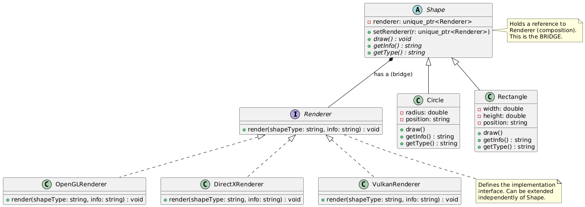

# 11. 组合模式

## 简介

> **组合模式(Composite Pattern)** 是一种**结构型设计模式**, 它**将对象组合成树形结构以表示“部分-整体”的层次结构**, 使得客户端对单个对象和组合对象的使用具有一致性。

🎯 核心思想: 

- **“部分-整体”统一接口** → 客户端无需区分叶子和容器
- 树形结构: 节点可以是叶子(Leaf)或容器(Composite)
- 递归组合 → 容器可包含叶子或其他容器

> 💡 经典比喻: 
>  **文件系统** —— 文件(叶子)和文件夹(容器)都可被“操作”, 如 `getSize()`、`display()`, 客户端无需关心是文件还是文件夹。

------

 🧩 结构组成: 

| 角色        | 说明                                                         |
| ----------- | ------------------------------------------------------------ |
| `Component` | 抽象基类, 声明叶子和容器的公共接口(如 `display()`, `getSize()`) |
| `Leaf`      | 叶子节点, 实现 `Component` 接口, 无子节点                    |
| `Composite` | 容器节点, 聚合子节点(`Component*`), 实现相同接口, 内部递归调用子节点 |

------

 ✅ 适用场景

1. **你想表示对象的“部分-整体”层次结构(树形结构)**
2. **希望客户端忽略组合对象与单个对象的差异, 统一处理**
3. **结构在运行时动态变化(如添加/删除子节点)**
4. **需要递归遍历或操作整个结构**

📌 **典型应用场景: **

- 📁 **文件系统**: 文件 + 文件夹
- 🎨 **图形界面**: 控件 + 容器控件(如 GroupBox、Panel)
- 🎮 **游戏对象**: GameObject + 子对象(如角色 + 装备 + 技能)
- 📊 **组织架构**: 员工 + 部门(部门可包含子部门)
- 📜 **XML/HTML DOM 树**: 节点 + 子节点

------

 ✅ 优缺点

 ✅ 优点: 

1. **定义了包含简单对象和复合对象的类层次结构** → 客户端统一处理
2. **简化客户端代码** → 无需判断是叶子还是容器
3. **更容易增加新类型的组件** → 符合开闭原则
4. **支持递归结构** → 天然适合树形数据

 ❌ 缺点: 

1. **设计更复杂** → 需要定义公共接口, 可能包含叶子不需要的方法
2. **类型系统限制** → 某些操作只对容器有意义(如 `addChild`), 叶子调用会出错
3. **可能违反接口隔离原则** → 叶子被迫实现无意义的方法

------

 ✅ 注意事项

 1. 🔄 两种设计风格: 

| 类型                 | 说明                                                       | 优点                         | 缺点                                         |
| -------------------- | ---------------------------------------------------------- | ---------------------------- | -------------------------------------------- |
| **透明方式(推荐)** | `Component` 声明所有方法(包括 `addChild`, `removeChild`) | 客户端完全统一, 无需类型判断 | 叶子需抛异常或空实现无意义方法               |
| **安全方式**         | 只在 `Composite` 中声明管理子节点的方法                    | 类型安全, 编译期检查         | 客户端需 `dynamic_cast` 判断类型, 破坏透明性 |

> ✅ **现代 C++ 推荐“透明方式” + 运行时异常/空操作**, 保持接口一致性。

------

 2. ⚠️ 叶子节点对容器方法的处理: 

```
// 透明方式 - Leaf 实现但抛异常
void addChild(std::unique_ptr<Component>) override {
    throw std::logic_error("Cannot add child to a leaf!");
}

// 或者空实现(静默失败, 不推荐)
void addChild(std::unique_ptr<Component>) override {}
```

> 🚨 **建议抛异常**, 避免静默失败导致调试困难。

------

 3. 🧹 内存管理建议: 

- 使用 `std::unique_ptr<Component>` 管理子节点生命周期
- Composite 析构时自动释放所有子节点
- 避免裸指针和手动 `delete`

------

 4. 🔄 递归操作注意栈溢出

- 超深树结构可能导致栈溢出 → 可改用迭代 + 栈模拟
- 通常业务场景深度有限, 无需过度担心

------

 5. 🧩 可选: 提供迭代器支持

```
class Composite : public Component {
    std::vector<std::unique_ptr<Component>> children;
public:
    using Iterator = decltype(children)::iterator;
    Iterator begin() { return children.begin(); }
    Iterator end() { return children.end(); }
};
```

🎯 **推荐语: **

> **当你需要处理树形结构(如文件系统、UI 控件树、组织架构)时, 组合模式是你最佳选择。它让复杂结构的操作变得简单而优雅！**

掌握组合模式, 你就能轻松驾驭任何“部分-整体”层次结构！

## 代码

```
// Composite.h
#include <iostream>
#include <string>
#include <vector>
#include <memory>
#include <stdexcept>

// ============ 抽象组件 ============
class FileSystemComponent {
public:
    virtual ~FileSystemComponent() = default;

    // 通用操作(透明方式)
    virtual void display(const std::string& prefix = "") const = 0;
    virtual size_t getSize() const = 0;
    virtual std::string getName() const = 0;

    // 容器操作(叶子需实现但抛异常)
    virtual void addChild(std::unique_ptr<FileSystemComponent> child) {
        throw std::logic_error("Cannot add child to a leaf node: " + getName());
    }

    virtual void removeChild(const std::string& name) {
        throw std::logic_error("Cannot remove child from a leaf node: " + getName());
    }

    virtual FileSystemComponent* getChild(const std::string& name) {
        throw std::logic_error("Leaf node has no children: " + getName());
    }
};

// ============ 叶子节点: 文件 ============
class File : public FileSystemComponent {
private:
    std::string name;
    size_t size;

public:
    File(const std::string& n, size_t s) : name(n), size(s) {}

    void display(const std::string& prefix = "") const override {
        std::cout << prefix << "📄 " << name << " (" << size << " KB)" << std::endl;
    }

    size_t getSize() const override {
        return size;
    }

    std::string getName() const override {
        return name;
    }
};

// ============ 容器节点: 目录 ============
class Directory : public FileSystemComponent {
private:
    std::string name;
    std::vector<std::unique_ptr<FileSystemComponent>> children;

public:
    Directory(const std::string& n) : name(n) {}

    void display(const std::string& prefix = "") const override {
        std::cout << prefix << "📁 " << name << "/" << std::endl;
        for (const auto& child : children) {
            child->display(prefix + "  "); // 递归显示
        }
    }

    size_t getSize() const override {
        size_t total = 0;
        for (const auto& child : children) {
            total += child->getSize(); // 递归计算
        }
        return total;
    }

    std::string getName() const override {
        return name;
    }

    // 容器特有操作
    void addChild(std::unique_ptr<FileSystemComponent> child) override {
        children.push_back(std::move(child));
    }

    void removeChild(const std::string& name) override {
        auto it = std::remove_if(children.begin(), children.end(),
            [&name](const std::unique_ptr<FileSystemComponent>& child) {
                return child->getName() == name;
            });
        if (it != children.end()) {
            children.erase(it, children.end());
        } else {
            throw std::runtime_error("Child not found: " + name);
        }
    }

    FileSystemComponent* getChild(const std::string& name) override {
        for (auto& child : children) {
            if (child->getName() == name) {
                return child.get();
            }
        }
        return nullptr;
    }
};

// ============ 客户端使用 ============
#include "Composite.h"

int main() {
    std::cout << "=== 组合模式: 文件系统模拟 ===\n\n";

    // 创建根目录
    auto root = std::make_unique<Directory>("root");

    // 添加文件
    root->addChild(std::make_unique<File>("readme.txt", 2));
    root->addChild(std::make_unique<File>("config.json", 1));

    // 创建子目录
    auto docs = std::make_unique<Directory>("documents");
    docs->addChild(std::make_unique<File>("report.pdf", 5000));
    docs->addChild(std::make_unique<File>("notes.txt", 100));

    auto pics = std::make_unique<Directory>("pictures");
    pics->addChild(std::make_unique<File>("photo1.jpg", 3000));
    pics->addChild(std::make_unique<File>("photo2.png", 2500));

    // 将子目录加入根目录
    root->addChild(std::move(docs));
    root->addChild(std::move(pics));

    // 显示整个文件树
    root->display();

    // 计算总大小
    std::cout << "\nTotal size: " << root->getSize() << " KB" << std::endl;

    // 尝试对叶子调用容器方法(应抛异常)
    std::cout << "\n=== 测试叶子节点异常 ===\n";
    auto file = std::make_unique<File>("test.txt", 10);
    try {
        file->addChild(std::make_unique<File>("invalid.txt", 0));
    } catch (const std::exception& e) {
        std::cout << "✅ Caught expected exception: " << e.what() << std::endl;
    }

    return 0;
}
```


## PlantUML

```
@startuml

' 抽象组件(透明方式)
abstract class FileSystemComponent {
    +display(prefix: string) : void {abstract}
    +getSize() : size_t {abstract}
    +getName() : string {abstract}
    +addChild(child: unique_ptr<FileSystemComponent>) : void
    +removeChild(name: string) : void
    +getChild(name: string) : FileSystemComponent*
}

' 叶子节点
class File {
    -name: string
    -size: size_t
    +display(prefix: string) : void
    +getSize() : size_t
    +getName() : string
    +addChild(...) {throws}
    +removeChild(...) {throws}
    +getChild(...) {throws}
}

' 容器节点
class Directory {
    -name: string
    -children: vector<unique_ptr<FileSystemComponent>>
    +display(prefix: string) : void
    +getSize() : size_t
    +getName() : string
    +addChild(child: unique_ptr<FileSystemComponent>) : void
    +removeChild(name: string) : void
    +getChild(name: string) : FileSystemComponent*
}

' 关系
FileSystemComponent <|-- File
FileSystemComponent <|-- Directory

note right of FileSystemComponent
    Transparent Composite:
    Declares all operations,
    Leaf throws on container methods.
end note

note bottom of Directory
    Manages child components
    recursively. Uses composition.
end note

@enduml
```

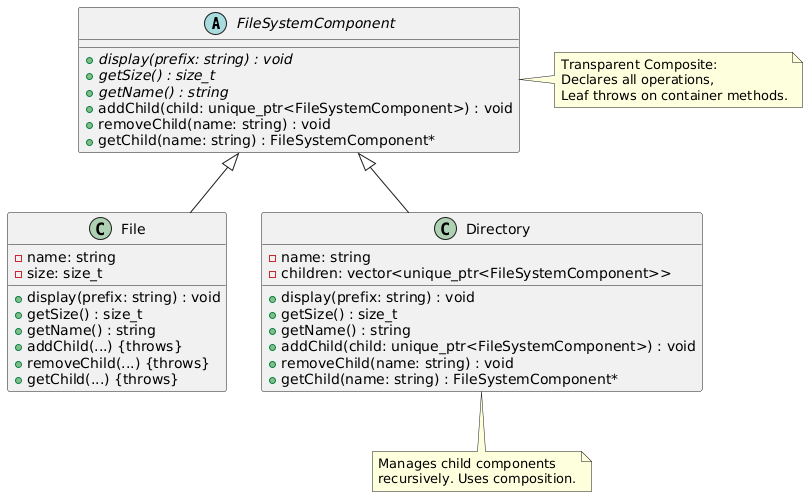

# 12.装饰器模式

## 简介

> **装饰器模式(Decorator Pattern)** 是一种**结构型设计模式**, 它**动态地给一个对象添加一些额外的职责(功能)**, 就增加功能来说, 装饰器模式相比生成子类更为灵活。

 🎯 核心思想: 

- **“套娃式”增强功能** —— 一层套一层, 每层添加新功能
- **继承是静态的, 装饰是动态的**
- **符合开闭原则** —— 对扩展开放, 对修改关闭

> 💡 经典比喻: 
>  **咖啡 + 配料** —— 基础咖啡(Espresso)可动态添加“牛奶”、“糖”、“巧克力”等装饰, 每加一层, 价格和描述都变化, 但仍然是“一杯咖啡”。

------

 🧩 结构组成: 

| 角色                | 说明                                                        |
| ------------------- | ----------------------------------------------------------- |
| `Component`         | 抽象组件, 定义对象接口(如 `cost()`, `getDescription()`)   |
| `ConcreteComponent` | 具体组件, 被装饰的原始对象                                  |
| `Decorator`         | 抽象装饰器, 继承 `Component`, 持有一个 `Component*`(组合) |
| `ConcreteDecorator` | 具体装饰器, 实现额外功能, 调用被装饰对象的方法并增强        |

------

 ✅ 适用场景

1. **需要在运行时动态、透明地给对象添加职责**
2. **扩展功能的方案有很多, 用继承会导致子类爆炸**
3. **职责可以“叠加”, 且顺序可能影响结果(如加密+压缩 vs 压缩+加密)**
4. **不希望修改原始类代码(如第三方库)**

📌 **典型应用场景: **

- ☕ **咖啡/饮料系统**: 基础饮品 + 各种配料(糖、奶、摩卡)
- 💾 **I/O 流增强**: `std::ostream` → 添加压缩、加密、日志功能
- 🎮 **游戏道具系统**: 基础武器 + 附魔(火焰、冰霜、吸血)
- 🧱 **GUI 控件装饰**: 基础按钮 + 边框装饰、滚动装饰、透明度装饰
- 📦 **网络请求中间件**: 基础请求 + 日志、重试、缓存、认证装饰器

------

 ✅ 优缺点

 ✅ 优点: 

1. **比继承更灵活** → 运行时动态组合功能
2. **避免类爆炸** → N 个功能组合 = N 个装饰器类, 而不是 2^N 个子类
3. **符合开闭原则** → 新增功能不修改原有代码
4. **可叠加、可嵌套** → 功能自由组合
5. **单一职责原则** → 每个装饰器只负责一个增强功能

 ❌ 缺点: 

1. **产生很多小对象** → 调试时调用栈较深
2. **过度使用会让系统复杂** → “套娃地狱”
3. **删除装饰器较困难** → 通常需重建对象链
4. **配置复杂对象时代码冗长** → 可结合 Builder 模式优化

------

 ✅ 注意事项

 1. 🔄 装饰器必须实现与组件相同的接口

```
class Decorator : public Component { ... };
```

> ✅ 客户端无需知道是否被装饰 → 透明性

------

 2. ⚠️ 装饰器持有组件的指针/引用(组合)

```
class MilkDecorator : public Beverage {
    std::unique_ptr<Beverage> beverage; // 关键: 组合而非继承功能
public:
    MilkDecorator(std::unique_ptr<Beverage> b) : beverage(std::move(b)) {}
    double cost() override { return beverage->cost() + 0.5; }
};
```

3. 🚫 装饰器 ≠ 继承/适配器/代理

4. ✅ 推荐使用智能指针管理组件生命周期

5. ✅ 装饰顺序可能影响结果

```
auto coffee = std::make_unique<Espresso>();
auto withMilk = std::make_unique<MilkDecorator>(std::move(coffee));
auto withSugar = std::make_unique<SugarDecorator>(std::move(withMilk));

// vs

auto coffee2 = std::make_unique<Espresso>();
auto withSugar2 = std::make_unique<SugarDecorator>(std::move(coffee2));
auto withMilk2 = std::make_unique<MilkDecorator>(std::move(withSugar2));
```

🎯 **推荐语: **

> **装饰器模式是解决“功能动态组合”问题的优雅方案。当你厌倦了继承导致的类爆炸, 装饰器模式就是你的救星！**

掌握装饰器模式, 你就能设计出高度灵活、可扩展、可组合的系统！

## 代码

```
// Decorator.h
#include <iostream>
#include <string>
#include <memory>

// ============ 抽象组件 ============
class Beverage {
public:
    virtual ~Beverage() = default;
    virtual double cost() const = 0;
    virtual std::string getDescription() const = 0;
};

// ============ 具体组件 ============
class Espresso : public Beverage {
public:
    double cost() const override {
        return 1.99;
    }

    std::string getDescription() const override {
        return "Espresso";
    }
};

class HouseBlend : public Beverage {
public:
    double cost() const override {
        return 0.89;
    }

    std::string getDescription() const override {
        return "House Blend Coffee";
    }
};

// ============ 抽象装饰器 ============
class CondimentDecorator : public Beverage {
protected:
    std::unique_ptr<Beverage> beverage;

public:
    CondimentDecorator(std::unique_ptr<Beverage> b) : beverage(std::move(b)) {}
    virtual ~CondimentDecorator() = default;
};

// ============ 具体装饰器 ============
class Milk : public CondimentDecorator {
public:
    Milk(std::unique_ptr<Beverage> b) : CondimentDecorator(std::move(b)) {}

    double cost() const override {
        return beverage->cost() + 0.10;
    }

    std::string getDescription() const override {
        return beverage->getDescription() + ", Milk";
    }
};

class Mocha : public CondimentDecorator {
public:
    Mocha(std::unique_ptr<Beverage> b) : CondimentDecorator(std::move(b)) {}

    double cost() const override {
        return beverage->cost() + 0.20;
    }

    std::string getDescription() const override {
        return beverage->getDescription() + ", Mocha";
    }
};

class Whip : public CondimentDecorator {
public:
    Whip(std::unique_ptr<Beverage> b) : CondimentDecorator(std::move(b)) {}

    double cost() const override {
        return beverage->cost() + 0.15;
    }

    std::string getDescription() const override {
        return beverage->getDescription() + ", Whip";
    }
};

// ============ 客户端 ============
#include "Decorator.h"

void printBeverage(const Beverage& b) {
    std::cout << b.getDescription() << " $" << b.cost() << std::endl;
}

int main() {
    std::cout << "=== 装饰器模式: 咖啡订单系统 ===\n\n";

    // 基础咖啡
    auto espresso = std::make_unique<Espresso>();
    printBeverage(*espresso);

    // 装饰: 加摩卡 + 打奶泡
    auto espressoWithMochaWhip = std::make_unique<Whip>(
        std::make_unique<Mocha>(std::move(espresso))
    );
    printBeverage(*espressoWithMochaWhip);

    // 另一杯: 混合咖啡 + 牛奶 + 摩卡 + 牛奶
    auto houseBlend = std::make_unique<HouseBlend>();
    auto fancyCoffee = std::make_unique<Milk>(
        std::make_unique<Mocha>(
            std::make_unique<Milk>(std::move(houseBlend))
        )
    );
    printBeverage(*fancyCoffee);

    return 0;
}
```

## PlantUML

```
@startuml

' 抽象组件
abstract class Beverage {
    +cost() : double {abstract}
    +getDescription() : string {abstract}
}

' 具体组件
class Espresso {
    +cost() : double
    +getDescription() : string
}

class HouseBlend {
    +cost() : double
    +getDescription() : string
}

' 抽象装饰器
abstract class CondimentDecorator {
    -beverage: unique_ptr<Beverage>
    +cost() : double {abstract}
    +getDescription() : string {abstract}
}

' 具体装饰器
class Milk {
    +cost() : double
    +getDescription() : string
}

class Mocha {
    +cost() : double
    +getDescription() : string
}

class Whip {
    +cost() : double
    +getDescription() : string
}

' 关系
Beverage <|-- Espresso
Beverage <|-- HouseBlend
Beverage <|-- CondimentDecorator

CondimentDecorator <|-- Milk
CondimentDecorator <|-- Mocha
CondimentDecorator <|-- Whip

CondimentDecorator *-- Beverage : "wraps"

note right of CondimentDecorator
    Holds a reference to
    a Beverage (composition).
    This is the DECORATOR core.
end note

note bottom of Milk
    Adds milk cost and
    description to any Beverage.
end note

@enduml
```

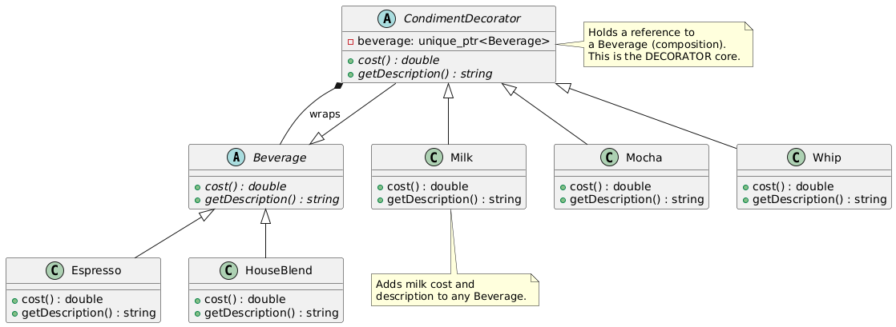


# 13. 外观模式

## 简介

> **外观模式(Facade Pattern)** 是一种**结构型设计模式**, 它**为子系统中的一组接口提供一个一致的、简化的高层接口**, 使得子系统更容易使用。

 🎯 核心思想: 

- **“封装复杂性, 提供简单门面”**
- **客户端无需了解子系统内部结构**
- **降低耦合, 统一入口**

> 💡 经典比喻: 
>  **酒店前台** —— 客人只需告诉前台“我要入住”, 前台会协调客房部、清洁部、安保部等多个部门完成入住流程, 客人无需与每个部门打交道。

------

 🧩 结构组成: 

| 角色                | 说明                                                         |
| ------------------- | ------------------------------------------------------------ |
| `Subsystem Classes` | 子系统中的多个复杂类(如 `Light`, `Thermostat`, `Security`) |
| `Facade`            | 外观类, 封装子系统调用, 提供简化接口(如 `turnOnHome()`, `turnOffHome()`) |
| `Client`            | 客户端, 只与 `Facade` 交互, 不直接访问子系统                 |

> 📌 **关键点: **
>  Facade **不封装新功能**, 只是**组合和简化已有功能的调用流程**。

------

 ✅ 适用场景

1. **子系统复杂, 接口众多, 使用困难**
2. **客户端与子系统之间存在过多直接依赖**
3. **需要为子系统提供一个统一、简化的访问入口**
4. **分层架构中, 上层模块需要简化对下层模块的调用**

📌 **典型应用场景: **

- 🏠 **智能家居系统**: 一键“回家模式” → 开灯 + 调温 + 解除警报
- 🛠️ **编译器子系统**: `compile()` → 词法分析 + 语法分析 + 代码生成
- 📦 **API 封装库**: 封装复杂的第三方库(如 OpenGL、FFmpeg)提供简单接口
- 🏦 **银行系统**: `applyLoan()` → 信用检查 + 风控审核 + 合同生成 + 放款
- 🎮 **游戏引擎启动**: `startGame()` → 加载资源 + 初始化音频 + 启动物理引擎 + 显示主菜单

------

 ✅ 优缺点

 ✅ 优点: 

1. **简化客户端使用** → 隐藏子系统复杂性
2. **降低耦合度** → 客户端只依赖外观, 不依赖具体子系统
3. **提高可维护性** → 子系统变化不影响客户端(只要外观接口不变)
4. **符合迪米特法则(最少知识原则)** → 客户端只需知道外观
5. **便于分层设计** → 每层可提供自己的外观

 ❌ 缺点: 

1. **不符合开闭原则** → 新增子系统功能可能需要修改外观类
2. **可能成为“上帝类”** → 如果外观承担过多职责, 会变得臃肿
3. **灵活性受限** → 客户端无法精细控制子系统(除非提供“逃生舱口”)

------

 ✅ 注意事项

 1. 🔄 外观 ≠ 封装所有功能

> 外观应提供**常用、高层**操作, 不是替代子系统。
>  应允许客户端在必要时**绕过外观**直接访问子系统(“逃生舱口”设计)。


```
class HomeFacade {
    LightSystem light;
    ACSystem ac;
public:
    void turnOnHome() { ... } // 简化接口

    // 逃生舱口: 允许直接访问子系统
    LightSystem& getLightSystem() { return light; }
};
```

------

 2. 🚫 外观 ≠ 适配器

| 模式   | 目的                     |
| ------ | ------------------------ |
| 外观   | **简化接口, 封装复杂性** |
| 适配器 | **转换接口, 兼容不匹配** |

> 💡 **外观 = “简化操作”, 适配器 = “接口翻译”**

------

 3. 🚫 外观 ≠ 中介者

| 模式   | 目的                     | 交互方式                     |
| ------ | ------------------------ | ---------------------------- |
| 外观   | **封装子系统, 单向调用** | Client → Facade → Subsystems |
| 中介者 | **协调对象间交互**       | Objects ↔ Mediator ↔ Objects |

> 💡 **外观是“门面”, 中介者是“调度中心”**

------

 4. ✅ 外观类应尽量保持无状态或轻状态

> 避免外观类承担业务逻辑或状态管理, 它只是“协调者”。

------

 5. ✅ 可设计多层外观(Layered Facade)

```
class LowLevelFacade { ... };     // 封装硬件驱动
class MidLevelFacade { ... };     // 封装业务逻辑
class HighLevelFacade { ... };    // 封装用户操作
```

------

 6. ✅ 外观类可被多个客户端共享

> 通常设计为无状态或使用依赖注入, 可安全共享。

 ✅ 一句话总结: 

> **“你只管说‘我要回家’, 剩下的交给我来协调！”**

🎯 **推荐语: **

> **外观模式是降低系统复杂度的利器。无论是封装第三方库、简化内部模块调用, 还是提供用户友好接口, 外观模式都能让你的代码更清晰、更易用！**

掌握外观模式, 你就掌握了“化繁为简”的架构艺术！

## 代码

```
// Facade.h
#include <iostream>
#include <string>

// ============ 子系统类 ============
class LightSystem {
public:
    void turnOn() { std::cout << "💡 Lights ON\n"; }
    void turnOff() { std::cout << "💡 Lights OFF\n"; }
    void setBrightness(int level) { std::cout << "🔆 Brightness set to " << level << "%\n"; }
};

class ACSystem {
public:
    void turnOn() { std::cout << "❄️ AC ON\n"; }
    void turnOff() { std::cout << "❄️ AC OFF\n"; }
    void setTemperature(int temp) { std::cout << "🌡️ Temperature set to " << temp << "°C\n"; }
};

class SecuritySystem {
public:
    void arm() { std::cout << "🔒 Security System ARMED\n"; }
    void disarm() { std::cout << "🔓 Security System DISARMED\n"; }
    void triggerAlarm() { std::cout << "🚨 ALARM TRIGGERED!\n"; }
};

class EntertainmentSystem {
public:
    void turnOnTV() { std::cout << "📺 TV ON\n"; }
    void turnOffTV() { std::cout << "📺 TV OFF\n"; }
    void playMusic() { std::cout << "🎵 Playing relaxing music...\n"; }
};

// ============ 外观类 ============
class HomeFacade {
private:
    LightSystem light;
    ACSystem ac;
    SecuritySystem security;
    EntertainmentSystem entertainment;

public:
    // 一键回家模式
    void activateHomeMode() {
        std::cout << "\n=== 🏠 Activating HOME Mode ===\n";
        security.disarm();
        light.turnOn();
        light.setBrightness(80);
        ac.turnOn();
        ac.setTemperature(24);
        entertainment.turnOnTV();
        entertainment.playMusic();
    }

    // 一键离家模式
    void activateAwayMode() {
        std::cout << "\n=== 🚪 Activating AWAY Mode ===\n";
        light.turnOff();
        ac.turnOff();
        entertainment.turnOffTV();
        security.arm();
    }

    // 一键睡眠模式
    void activateSleepMode() {
        std::cout << "\n=== 😴 Activating SLEEP Mode ===\n";
        light.setBrightness(10);
        ac.setTemperature(26);
        entertainment.turnOffTV();
    }

    // 逃生舱口: 允许直接访问子系统
    LightSystem& getLightSystem() { return light; }
    ACSystem& getACSystem() { return ac; }
};

// ============ 客户端使用 ============
#include "Facade.h"

int main() {
    std::cout << "=== 外观模式: 智能家居系统 ===\n";

    HomeFacade home;

    // 用户只需操作外观, 无需了解子系统细节
    home.activateHomeMode();
    home.activateSleepMode();
    home.activateAwayMode();

    // 特殊需求: 直接调用子系统(逃生舱口)
    std::cout << "\n=== 特殊操作: 直接调光 ===\n";
    home.getLightSystem().setBrightness(50);

    return 0;
}
```

输出

```
=== 外观模式: 智能家居系统 ===

=== 🏠 Activating HOME Mode ===
🔓 Security System DISARMED
💡 Lights ON
🔆 Brightness set to 80%
❄️ AC ON
🌡️ Temperature set to 24°C
📺 TV ON
🎵 Playing relaxing music...

=== 😴 Activating SLEEP Mode ===
🔆 Brightness set to 10%
🌡️ Temperature set to 26°C
📺 TV OFF

=== 🚪 Activating AWAY Mode ===
💡 Lights OFF
❄️ AC OFF
📺 TV OFF
🔒 Security System ARMED

=== 特殊操作: 直接调光 ===
🔆 Brightness set to 50%
```


## PlantUML

```
@startuml

' 子系统类
class LightSystem {
    +turnOn()
    +turnOff()
    +setBrightness(level)
}

class ACSystem {
    +turnOn()
    +turnOff()
    +setTemperature(temp)
}

class SecuritySystem {
    +arm()
    +disarm()
    +triggerAlarm()
}

class EntertainmentSystem {
    +turnOnTV()
    +turnOffTV()
    +playMusic()
}

' 外观类
class HomeFacade {
    -light: LightSystem
    -ac: ACSystem
    -security: SecuritySystem
    -entertainment: EntertainmentSystem
    +activateHomeMode()
    +activateAwayMode()
    +activateSleepMode()
    +getLightSystem() : LightSystem&
}

' 客户端
class Client {
    +main()
}

' 关系
Client --> HomeFacade : uses
HomeFacade --> LightSystem : uses
HomeFacade --> ACSystem : uses
HomeFacade --> SecuritySystem : uses
HomeFacade --> EntertainmentSystem : uses

note right of HomeFacade
    Provides simplified interface
    to complex subsystem.
    Follows "Facade Pattern".
end note

note bottom of Client
    Only interacts with Facade,
    not with subsystem classes.
end note

@enduml
```

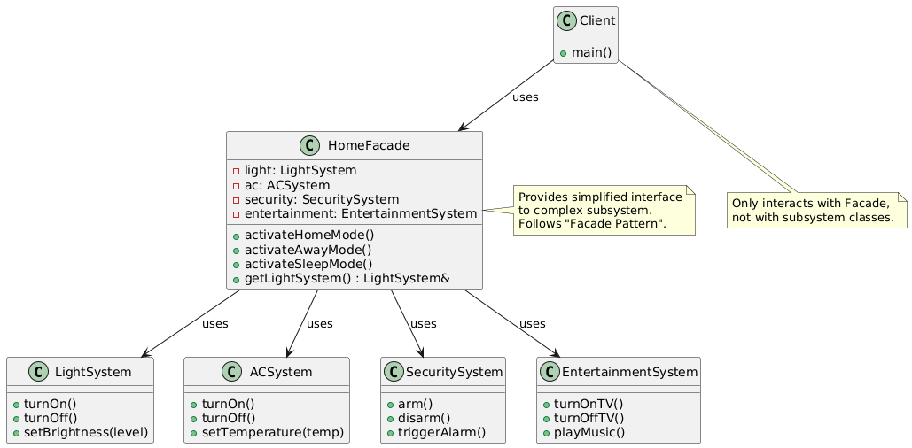


# 14. 享元模式

## 简介

> **享元模式(Flyweight Pattern)** 是一种**结构型设计模式**, 它**通过共享技术, 有效地支持大量细粒度对象的复用**, 从而**减少内存占用和对象创建开销**。

 🎯 核心思想: 

- **“共享相同状态的对象, 避免重复创建”**
- **区分内部状态(可共享)和外部状态(不可共享)**
- **使用“享元工厂”管理共享对象池**

> 💡 经典比喻: 
>  **文字处理器中的字符对象** —— 字母 `'A'` 在文档中出现 1000 次, 但内存中只需创建一个 `'A'` 对象, 通过外部状态(位置、颜色、字体大小)来区分每次渲染。

------

 🧩 结构组成: 

| 角色                | 说明                                                         |
| ------------------- | ------------------------------------------------------------ |
| `Flyweight`         | 抽象享元类, 定义接口(如 `render(x, y)`), 接受外部状态参数  |
| `ConcreteFlyweight` | 具体享元类, 存储**内部状态**(如字符、图片ID), 实现共享逻辑 |
| `FlyweightFactory`  | 享元工厂, 创建并管理享元对象池(通常用 `std::map` 或 `std::unordered_map`) |
| `Client`            | 客户端, 维护**外部状态**(如位置、颜色), 调用享元对象       |

> 📌 **关键概念: **
>
> - **内部状态(Intrinsic State)**: 存储在享元对象内部, 可共享(如字符、纹理ID)
> - **外部状态(Extrinsic State)**: 由客户端传入, 不可共享(如坐标、颜色、旋转角度)

------

 ✅ 适用场景

1. **程序中存在大量相似对象, 造成内存压力**
2. **对象大部分状态可以外部化(提取为参数)**
3. **对象可被缓存和复用**
4. **性能或内存是关键瓶颈**

📌 **典型应用场景: **

- 📝 **文字编辑器/排版系统**: 共享字符对象(如 1000 个 'A' → 1 个对象)

- 🎮

   

  游戏开发

  : 

  - 子弹、粒子、敌人类型(相同类型的对象共享纹理、模型)
  - 地图瓦片系统(相同地形共享贴图)

- 🖼️ **图形界面系统**: 图标、按钮样式共享

- 🧬 **生物信息学**: 共享 DNA 碱基对象(A, T, C, G)

- 📊 **数据可视化**: 共享柱状图、饼图的样式对象

------

 ✅ 优缺点

 ✅ 优点: 

1. **极大减少内存占用** → 共享对象, 避免重复创建
2. **提升性能** → 减少对象创建/销毁开销
3. **外部状态与内部状态分离** → 职责清晰
4. **适合大规模对象系统** → 如游戏、图形、文本处理

 ❌ 缺点: 

1. **代码复杂度增加** → 需管理对象池、区分内外状态
2. **外部状态需客户端维护** → 增加客户端负担
3. **线程安全问题** → 多线程访问工厂需加锁(C++ 中)
4. **调试困难** → 对象被多个客户端共享, 状态追踪复杂

------

 ✅ 注意事项

 1. 🔄 必须区分内部状态和外部状态


```
class CharacterFlyweight {
    char symbol; // 内部状态: 可共享(如 'A')
public:
    void render(int x, int y, Color color); // 外部状态: 位置、颜色由客户端传入
};
```

> ✅ 内部状态 = 对象本质属性(不变或极少变)
>  ✅ 外部状态 = 上下文相关属性(每次调用可能不同)

------

 2. ⚠️ 享元对象应尽量**不可变(Immutable)**

> 一旦创建, 内部状态不应被修改, 确保线程安全和共享安全。


```
class TreeType { // 不可变享元
    std::string name;
    Color color;
    Texture texture;
public:
    TreeType(std::string n, Color c, Texture t) : name(n), color(c), texture(t) {}
    void draw(int x, int y) const { ... } // const 方法
};
```

------

 3. 🚫 享元 ≠ 单例

| 模式 | 目的                 |
| ---- | -------------------- |
| 享元 | **共享大量相似对象** |
| 单例 | **确保全局唯一实例** |

> 💡 享元池中可能有多个不同享元对象(如 'A', 'B', 'C' 各一个), 单例只有一个对象。

------

 4. ✅ 使用智能指针或引用管理享元对象


```
std::shared_ptr<Flyweight> getFlyweight(const std::string& key);
```

> 避免裸指针, 防止内存泄漏。工厂应管理生命周期。

------

 5. ⚠️ 线程安全(C++ 多线程环境)


```
class FlyweightFactory {
    std::unordered_map<std::string, std::shared_ptr<Flyweight>> pool;
    mutable std::mutex mtx; // 保护 pool

public:
    std::shared_ptr<Flyweight> getFlyweight(const std::string& key) {
        std::lock_guard<std::mutex> lock(mtx);
        if (pool.find(key) == pool.end()) {
            pool[key] = std::make_shared<ConcreteFlyweight>(key);
        }
        return pool[key];
    }
};
```

------

 6. ✅ 享元工厂应提供清除机制(可选)

> 防止内存泄漏, 可定期清理未使用对象(引用计数 or LRU 策略)。

------

 7. ✅ 适用于“大量对象 + 重复状态”场景

> 如果对象数量少或状态几乎不重复, 享元模式反而增加复杂度。


## 代码

```
// Flyweight.h
#include <iostream>
#include <string>
#include <unordered_map>
#include <memory>
#include <mutex>

// ============ 外部状态: 由客户端维护 ============
struct Position {
    int x, y;
    Position(int x, int y) : x(x), y(y) {}
};

enum class Color { RED, GREEN, BLUE, BLACK };

// ============ 抽象享元 ============
class CharacterFlyweight {
public:
    virtual ~CharacterFlyweight() = default;
    virtual void render(const Position& pos, Color color) const = 0;
    virtual char getSymbol() const = 0;
};

// ============ 具体享元 ============
class ConcreteCharacter : public CharacterFlyweight {
    char symbol; // 内部状态: 可共享

public:
    ConcreteCharacter(char c) : symbol(c) {
        std::cout << "Creating character: '" << symbol << "'\n";
    }

    void render(const Position& pos, Color color) const override {
        std::string colorStr = (color == Color::RED) ? "RED" :
                              (color == Color::GREEN) ? "GREEN" :
                              (color == Color::BLUE) ? "BLUE" : "BLACK";
        std::cout << "Rendering '" << symbol << "' at (" << pos.x << "," << pos.y
                  << ") in " << colorStr << " color.\n";
    }

    char getSymbol() const override { return symbol; }
};

// ============ 享元工厂 ============
class CharacterFactory {
private:
    std::unordered_map<char, std::shared_ptr<CharacterFlyweight>> pool;
    mutable std::mutex mtx;

public:
    std::shared_ptr<CharacterFlyweight> getCharacter(char c) {
        std::lock_guard<std::mutex> lock(mtx);
        if (pool.find(c) == pool.end()) {
            pool[c] = std::make_shared<ConcreteCharacter>(c);
        }
        return pool[c];
    }

    size_t getPoolSize() const {
        std::lock_guard<std::mutex> lock(mtx);
        return pool.size();
    }
};

// ============ 客户端 ============
#include "Flyweight.h"

int main() {
    std::cout << "=== 享元模式: 字符渲染系统 ===\n\n";

    CharacterFactory factory;

    // 模拟渲染文档中的字符
    std::string document = "AAABBBCCCDDDAAABBB";

    std::cout << "Rendering document: " << document << "\n\n";

    int x = 0, y = 0;
    for (char c : document) {
        auto character = factory.getCharacter(c);
        character->render(Position(x, y), Color::BLACK);
        x += 10; // 水平移动
        if (x > 50) { x = 0; y += 20; } // 换行
    }

    std::cout << "\n=== 统计 ===\n";
    std::cout << "文档长度: " << document.length() << " 字符\n";
    std::cout << "享元池大小: " << factory.getPoolSize() << " 个对象\n";
    std::cout << "节省对象: " << document.length() - factory.getPoolSize() << " 个\n";

    return 0;
}
```


## PlantUML

```
@startuml

' 抽象享元
abstract class Flyweight {
    +render(extrinsicState) {abstract}
}

' 具体享元
class ConcreteFlyweight {
    -intrinsicState
    +render(extrinsicState)
}

' 享元工厂
class FlyweightFactory {
    -pool: Map<Key, Flyweight>
    +getFlyweight(key): Flyweight
}

' 客户端
class Client {
    -extrinsicState
    +operation()
}

' 关系
Flyweight <|-- ConcreteFlyweight
FlyweightFactory --> Flyweight : manages pool
Client --> FlyweightFactory : requests
Client --> Flyweight : uses

note right of Flyweight
    Defines interface for
    rendering with extrinsic state.
end note

note right of ConcreteFlyweight
    Stores intrinsic state.
    Immutable recommended.
end note

note bottom of FlyweightFactory
    Creates and manages
    shared flyweight objects.
    Thread-safe in C++.
end note

note top of Client
    Maintains extrinsic state
    and coordinates rendering.
end note

@enduml
```

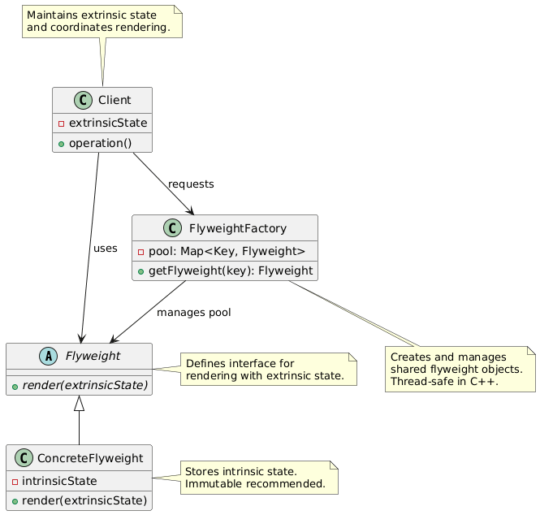


# 15. 代理模式

## 简介

> **代理模式(Proxy Pattern)** 是一种**结构型设计模式**, 它**为另一个对象提供一个替身或占位符, 以控制对这个对象的访问**。

 🎯 核心思想: 

- **“代替真实对象, 控制访问”**
- **代理与真实对象实现相同接口**
- **客户端无感知, 以为在操作真实对象**

> 💡 经典比喻: 
>  **游戏代练** —— 你(客户端)以为自己在打游戏, 其实是代练(代理)在操作你的账号(真实对象), 他可以控制你什么时候能玩、能不能玩、玩之前要不要交钱。

------

 🧩 结构组成: 

| 角色          | 说明                                                         |
| ------------- | ------------------------------------------------------------ |
| `Subject`     | 抽象主题接口(如 `IImage`, `IService`)                      |
| `RealSubject` | 真实对象(如 `RealImage`, `RealService`), 执行实际业务逻辑  |
| `Proxy`       | 代理对象, 持有对 `RealSubject` 的引用, 控制访问(如延迟加载、权限检查) |
| `Client`      | 客户端, 通过 `Proxy` 访问 `RealSubject`, 无感知              |

> 📌 **关键点: **
>  代理与真实对象**实现同一接口**, 客户端**无需修改代码**即可切换。

------

 ✅ 适用场景

1. **延迟初始化(Lazy Initialization)** —— 对象创建开销大, 首次使用时才创建
2. **访问控制(Access Control)** —— 权限检查、登录验证
3. **远程代理(Remote Proxy)** —— 本地代表远程对象(如 RPC、Web Service)
4. **日志记录 / 监控** —— 调用前后记录日志、统计耗时
5. **缓存代理(Caching Proxy)** —— 缓存结果, 避免重复计算
6. **智能指针 / 引用计数** —— 控制对象生命周期

📌 **典型应用场景: **

- 🖼️ **图像懒加载**: 图片首次显示时才从磁盘/网络加载
- 🔐 **权限控制**: 访问敏感操作前检查用户权限
- 🌐 **远程服务调用**: 本地代理封装网络通信
- ⏱️ **性能监控**: 记录方法执行时间
- 💾 **缓存数据库查询结果**
- 🧵 **线程安全代理**: 为非线程安全对象添加锁

------

 ✅ 优缺点

 ✅ 优点: 

1. **控制访问** → 可添加权限、日志、缓存等逻辑
2. **延迟加载** → 节省内存和初始化时间
3. **客户端透明** → 无需修改客户端代码
4. **职责分离** → 代理负责“控制”, 真实对象负责“业务”
5. **扩展性强** → 可叠加多个代理(如: 缓存代理 + 权限代理)

 ❌ 缺点: 

1. **增加系统复杂度** → 多一层代理类
2. **可能降低性能** → 代理层增加调用开销(通常可忽略)
3. **调试困难** → 调用链变长, 需跟踪代理逻辑
4. **生命周期管理复杂** → 代理和真实对象的析构顺序需注意(C++)

------

 ✅ 注意事项

 1. 🔄 代理 ≠ 装饰器

| 模式   | 目的                                 |
| ------ | ------------------------------------ |
| 代理   | **控制访问**(何时、能否、如何访问) |
| 装饰器 | **动态添加功能**(增强行为)         |

> 💡 **代理 = “门卫”, 装饰器 = “包装纸”**


```
// 代理: 控制是否允许访问
if (user.hasPermission()) realObject->operation();

// 装饰器: 增强功能
decorated->operation(); // 内部调用 component->operation() + 额外逻辑
```

------

 2. 🔄 代理 ≠ 适配器

| 模式   | 目的                   |
| ------ | ---------------------- |
| 代理   | **相同接口, 控制访问** |
| 适配器 | **转换接口, 兼容调用** |

> 💡 代理不改变接口, 适配器改变接口。

------

 3. ⚠️ 代理应持有真实对象的**智能指针或引用**


```
class ImageProxy : public IImage {
    std::unique_ptr<RealImage> realImage; // 或 shared_ptr
public:
    void display() override {
        if (!realImage) {
            realImage = std::make_unique<RealImage>("huge_image.jpg");
        }
        realImage->display();
    }
};
```

> ✅ 避免裸指针, 防止内存泄漏
>  ✅ `unique_ptr`: 代理独占所有权
>  ✅ `shared_ptr`: 允许多个代理共享真实对象

------

 4. ✅ 代理可组合(代理链)


```
// 权限代理 → 缓存代理 → 真实对象
auto service = std::make_shared<RealService>();
auto cached = std::make_shared<CachingProxy>(service);
auto secured = std::make_shared<SecurityProxy>(cached);
```

------

 5. ⚠️ 注意析构顺序(C++)

> 若代理持有真实对象, 确保代理析构时真实对象仍有效(通常代理负责销毁)。

------

 6. ✅ 适用于“访问控制”、“延迟加载”、“远程调用”等场景

> 如果只是简单封装, 考虑是否过度设计。


 ✅ 一句话总结: 

> **代理模式 = “对象的替身”, 在不改变接口的前提下, 控制对真实对象的访问。**

> **“你想操作真实对象？先过我这关！”**

🎯 **推荐语: **

> **代理模式是构建安全、高效、可扩展系统的关键模式。无论是延迟加载、权限控制还是远程调用, 代理模式都能让你在不侵入业务代码的前提下, 优雅地添加控制逻辑！**

掌握代理模式, 你就掌握了“控制的艺术”！

## 代码

远程服务代理(模拟 RPC)

```
#include <iostream>
#include <string>
#include <thread>
#include <chrono>

// 抽象远程服务
class IRemoteService {
public:
    virtual ~IRemoteService() = default;
    virtual std::string getData() = 0;
};

// 真实远程服务(模拟网络延迟)
class RealRemoteService : public IRemoteService {
public:
    std::string getData() override {
        std::cout << "🌐 Connecting to remote server...\n";
        std::this_thread::sleep_for(std::chrono::seconds(2)); // 模拟网络延迟
        return "Data from remote server";
    }
};

// 远程代理(本地存根)
class RemoteProxy : public IRemoteService {
    mutable std::unique_ptr<RealRemoteService> realService;
    mutable std::string cachedData;
    mutable bool isCached = false;

public:
    std::string getData() override {
        if (!realService) {
            realService = std::make_unique<RealRemoteService>();
        }

        if (!isCached) {
            std::cout << "📡 Proxy: Fetching data for the first time...\n";
            cachedData = realService->getData();
            isCached = true;
        } else {
            std::cout << "💾 Proxy: Returning cached data...\n";
        }

        return cachedData;
    }
};

int main() {
    std::cout << "=== 代理模式: 远程服务代理 ===\n\n";

    RemoteProxy proxy;

    // 第一次调用: 真实网络请求
    std::cout << "First call: " << proxy.getData() << "\n\n";

    // 第二次调用: 返回缓存
    std::cout << "Second call: " << proxy.getData() << "\n";

    return 0;
}
```

## PlantUML

```
@startuml

' 设置主题和样式(可选)
skinparam class {
    BackgroundColor White
    BorderColor #333333
    FontSize 14
}
skinparam interface {
    BackgroundColor LightBlue
    BorderColor #3333CC
    FontStyle italic
}

' 定义抽象接口
interface IRemoteService {
    +getData() : string
}

' 定义具体实现类
class RealRemoteService {
    +getData() : string
}

' 定义代理类
class RemoteProxy {
    -realService : unique_ptr<RealRemoteService>
    -cachedData : string
    -isCached : bool
    +getData() : string
}

' 继承关系
RealRemoteService --|> IRemoteService
RemoteProxy --|> IRemoteService

' 代理类聚合真实服务(组合关系, 用菱形实线)
RemoteProxy o-- "1" RealRemoteService : creates and holds

' 添加注释说明
note right of RemoteProxy
  代理模式实现: 
  - 首次调用创建真实服务
  - 缓存结果以提高后续性能
  - 对客户端透明
end note

note right of RealRemoteService
  真实远程服务: 
  - 模拟网络延迟
  - 实际数据来源
end note

@enduml
```

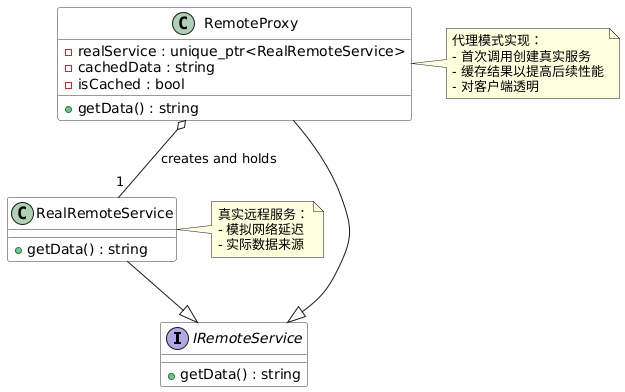


# 🔄行为型模式

# 16. 策略模式

## 简介

> **策略模式(Strategy Pattern)** 是一种**行为型设计模式**, 它**定义一系列算法或行为, 并将每个算法封装起来, 使它们可以互换, 让算法的变化独立于使用它的客户端**。

 🎯 核心思想: 

- **“封装变化, 互换算法”**
- **将算法抽象为策略接口**
- **客户端通过组合方式使用不同策略, 而非继承**

> 💡 经典比喻: 
>  **导航App中的路线策略** —— 你可以随时切换“最短路径”、“最少收费”、“避开高速”, 而App本身结构不变。

------

 🧩 结构组成: 

| 角色                    | 说明                                                         |
| ----------------------- | ------------------------------------------------------------ |
| `Strategy`              | 抽象策略接口(如 `ISortStrategy`, `IPaymentStrategy`)       |
| `ConcreteStrategyA/B/C` | 具体策略类(如 `QuickSort`, `CreditCardPayment`), 实现不同算法 |
| `Context`               | 上下文类, 持有策略对象引用, 提供调用接口(如 `Sorter`, `PaymentProcessor`) |
| `Client`                | 客户端, 选择并设置具体策略, 触发行为                         |

> 📌 **关键点: **
>
> - 策略模式使用**组合而非继承**实现算法切换
> - 客户端决定使用哪个策略
> - 策略对象可动态替换

------

 ✅ 适用场景

1. **多种算法/行为可互换**(如排序、支付、压缩、加密)
2. **避免大量条件语句(if-else / switch)**
3. **需要运行时动态切换算法**
4. **算法需独立于使用它的类**
5. **不同用户/场景需要不同行为**

📌 **典型应用场景: **

- 🧮 **排序算法切换**: 快速排序、归并排序、冒泡排序
- 💳 **支付方式**: 信用卡、支付宝、微信、PayPal
- 🎮 **游戏角色AI行为**: 攻击、逃跑、巡逻
- 🧭 **导航路径规划**: 最短时间、最少收费、避开高速
- 📦 **数据压缩算法**: ZIP、GZIP、LZ4
- 🔐 **加密算法**: AES、RSA、DES

------

 ✅ 优缺点

 ✅ 优点: 

1. **算法可自由切换** → 运行时动态更换策略
2. **避免条件语句** → 代码更清晰、易维护
3. **扩展性强** → 新增策略无需修改上下文或客户端
4. **符合开闭原则** → 对扩展开放, 对修改关闭
5. **职责分离** → 策略专注算法, 上下文专注协调

 ❌ 缺点: 

1. **增加类数量** → 每个策略一个类
2. **客户端需了解策略差异** → 需知道选哪个策略合适
3. **策略间切换可能有状态丢失风险**(若策略有内部状态)
4. **过度设计风险** → 简单场景用 if-else 更直接

------

 ✅ 注意事项

 1. 🔄 策略模式 ≠ 状态模式

| 模式     | 目的                     | 切换控制者     |
| -------- | ------------------------ | -------------- |
| 策略模式 | **客户端决定切换算法**   | 客户端主动设置 |
| 状态模式 | **对象内部状态驱动行为** | 对象自身切换   |

> 💡 **策略 = “我选哪个算法”, 状态 = “我现在是什么状态, 该做什么”**


```
// 策略: 客户端设置
context.setStrategy(new QuickSort());

// 状态: 对象根据内部状态自动切换
state.handle(); // 内部可能切换到下一个状态
```

------

 2. ⚠️ 策略对象应尽量**无状态(Stateless)**

> 有状态策略在切换时可能丢失数据, 增加复杂度。


```
// ✅ 无状态策略(推荐)
class QuickSort : public ISortStrategy {
public:
    void sort(std::vector<int>& data) override {
        // 不保存任何成员变量
        std::sort(data.begin(), data.end()); // 简化示例
    }
};

// ❌ 有状态策略(谨慎使用)
class CountingSort : public ISortStrategy {
    int maxVal; // 内部状态
public:
    void sort(std::vector<int>& data) override { ... }
};
```

------

 3. ✅ 使用智能指针管理策略对象(C++)


```
class Sorter {
    std::unique_ptr<ISortStrategy> strategy;
public:
    void setStrategy(std::unique_ptr<ISortStrategy> s) {
        strategy = std::move(s);
    }
    void execute(std::vector<int>& data) {
        if (strategy) strategy->sort(data);
    }
};
```

> ✅ `unique_ptr`: 独占所有权, 策略由上下文管理
>  ✅ `shared_ptr`: 多个上下文共享同一策略

------

 4. ✅ 策略可配置化(工厂 + 配置文件)


```
std::unique_ptr<ISortStrategy> createStrategy(const std::string& type) {
    if (type == "quick") return std::make_unique<QuickSort>();
    if (type == "merge") return std::make_unique<MergeSort>();
    throw std::invalid_argument("Unknown strategy");
}
```

------

 5. ✅ 适用于“算法族”、“行为族”场景

> 如果算法差异大、使用频繁、需动态切换, 策略模式是首选。

------

 6. ⚠️ 避免策略“上帝类”

> 每个策略应职责单一, 避免一个策略做太多事。

🎯 **推荐语: **

> **策略模式是消除条件语句、实现算法自由切换的利器。无论是排序、支付、AI行为, 只要你想“换算法如换衣服”, 策略模式就是你的最佳选择！**

掌握策略模式, 你就掌握了“算法自由的艺术”！


## 代码

```
// Strategy.h
#include <iostream>
#include <vector>
#include <memory>
#include <algorithm>

// ============ 抽象策略 ============
class ISortStrategy {
public:
    virtual ~ISortStrategy() = default;
    virtual void sort(std::vector<int>& data) = 0;
    virtual std::string getName() const = 0;
};

// ============ 具体策略 ============
class QuickSort : public ISortStrategy {
public:
    void sort(std::vector<int>& data) override {
        std::sort(data.begin(), data.end()); // 简化, 实际应实现快排
    }
    std::string getName() const override { return "QuickSort"; }
};

class BubbleSort : public ISortStrategy {
public:
    void sort(std::vector<int>& data) override {
        for (size_t i = 0; i < data.size(); ++i) {
            for (size_t j = 0; j < data.size() - i - 1; ++j) {
                if (data[j] > data[j + 1]) {
                    std::swap(data[j], data[j + 1]);
                }
            }
        }
    }
    std::string getName() const override { return "BubbleSort"; }
};

class MergeSort : public ISortStrategy {
public:
    void sort(std::vector<int>& data) override {
        if (data.size() <= 1) return;
        std::vector<int> temp(data.size());
        mergeSortImpl(data, temp, 0, data.size() - 1);
    }

private:
    void mergeSortImpl(std::vector<int>& data, std::vector<int>& temp, int left, int right) {
        if (left >= right) return;
        int mid = left + (right - left) / 2;
        mergeSortImpl(data, temp, left, mid);
        mergeSortImpl(data, temp, mid + 1, right);
        merge(data, temp, left, mid, right);
    }

    void merge(std::vector<int>& data, std::vector<int>& temp, int left, int mid, int right) {
        for (int i = left; i <= right; ++i) temp[i] = data[i];
        int i = left, j = mid + 1, k = left;
        while (i <= mid && j <= right) {
            if (temp[i] <= temp[j]) data[k++] = temp[i++];
            else data[k++] = temp[j++];
        }
        while (i <= mid) data[k++] = temp[i++];
        while (j <= right) data[k++] = temp[j++];
    }

public:
    std::string getName() const override { return "MergeSort"; }
};

// ============ 上下文 ============
class Sorter {
    std::unique_ptr<ISortStrategy> strategy;

public:
    void setStrategy(std::unique_ptr<ISortStrategy> s) {
        strategy = std::move(s);
        std::cout << "🔄 Strategy set to: " << strategy->getName() << "\n";
    }

    void execute(std::vector<int>& data) {
        if (!strategy) {
            std::cout << "❌ No strategy set!\n";
            return;
        }
        std::cout << "▶️ Executing " << strategy->getName() << "...\n";
        strategy->sort(data);
    }
};

// ============ 工具函数 ============
void printVector(const std::vector<int>& v, const std::string& title) {
    std::cout << title << ": ";
    for (int x : v) std::cout << x << " ";
    std::cout << "\n";
}

// ============ 客户端 ============
#include "Strategy.h"

int main() {
    std::cout << "=== 策略模式: 排序算法切换 ===\n\n";

    Sorter sorter;
    std::vector<int> data = {64, 34, 25, 12, 22, 11, 90};

    printVector(data, "Original data");

    // 使用冒泡排序
    sorter.setStrategy(std::make_unique<BubbleSort>());
    sorter.execute(data);
    printVector(data, "After BubbleSort");

    // 重置数据
    data = {64, 34, 25, 12, 22, 11, 90};

    // 使用快速排序
    sorter.setStrategy(std::make_unique<QuickSort>());
    sorter.execute(data);
    printVector(data, "After QuickSort");

    // 重置数据
    data = {64, 34, 25, 12, 22, 11, 90};

    // 使用归并排序
    sorter.setStrategy(std::make_unique<MergeSort>());
    sorter.execute(data);
    printVector(data, "After MergeSort");

    return 0;
}
```


## PlantUML

```
@startuml

' 抽象策略
interface Strategy {
    +algorithmInterface()
}

' 具体策略
class ConcreteStrategyA {
    +algorithmInterface()
}

class ConcreteStrategyB {
    +algorithmInterface()
}

class ConcreteStrategyC {
    +algorithmInterface()
}

' 上下文
class Context {
    -strategy: Strategy
    +setStrategy(strategy: Strategy)
    +contextInterface()
}

' 客户端
class Client {
    +main()
}

' 关系
Strategy <|-- ConcreteStrategyA
Strategy <|-- ConcreteStrategyB
Strategy <|-- ConcreteStrategyC
Context --> Strategy : uses
Client --> Context : configures
Client --> Strategy : creates

note right of Strategy
    Declares interface
    common to all supported
    algorithms.
end note

note right of ConcreteStrategyA
    Implements the algorithm
    using the Strategy interface.
end note

note bottom of Context
    Maintains a reference to a
    Strategy object and calls
    its algorithmInterface().
end note

note top of Client
    Chooses and sets the
    concrete strategy.
end note

@enduml
```

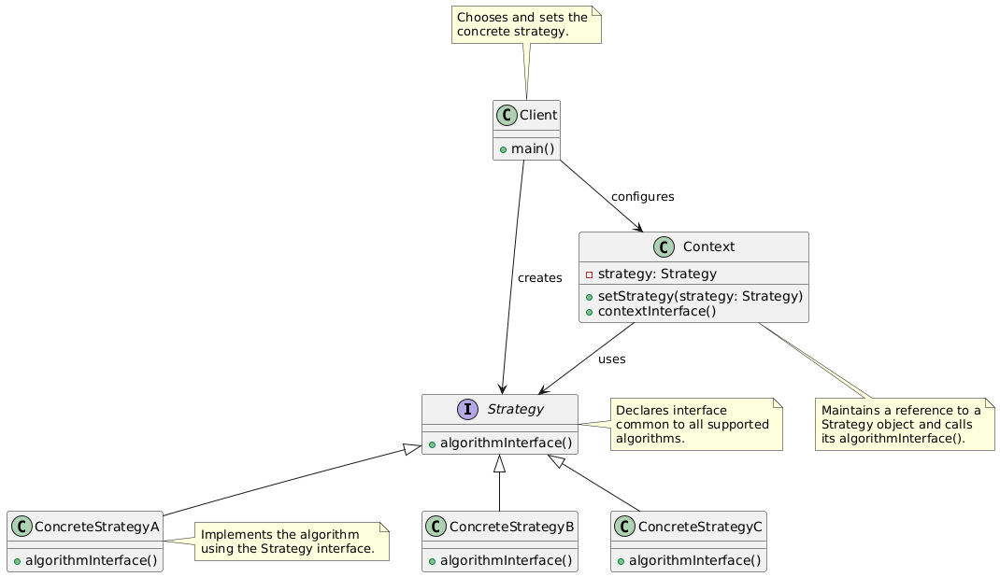


# 17. 模板方法模式

## 简介


> C++ 模板方法模式(Template Method Pattern)
> **定义算法骨架, 将某些步骤延迟到子类实现。**
>  —— 父类控制流程, 子类实现细节。

------

📌 1. 介绍

- **类型**: 行为型模式
- **核心思想**: 
  - 在**抽象基类**中定义一个**模板方法(通常是 final 或非虚函数)**, 它按固定顺序调用多个步骤。
  - 其中部分步骤是**纯虚函数或虚函数**, 由子类实现具体行为。
  - 父类控制“不变的流程”, 子类提供“可变的实现”。
- **关键词**: 算法骨架、继承、钩子方法、好莱坞原则(“Don’t call us, we’ll call you”)

------

🎯 2. 适用场景

 ✔ 算法结构稳定, 但某些步骤实现可变(如泡茶/咖啡、数据处理流程、游戏关卡流程)
 ✔ 需要控制子类扩展范围, 防止破坏算法结构
 ✔ 多个子类有公共行为, 希望避免代码重复
 ✔ 框架设计中, 提供标准流程, 允许用户自定义部分步骤

------

⚖️ 3. 优缺点

| 优点                                         | 缺点                                 |
| -------------------------------------------- | ------------------------------------ |
| ✅ 封装不变部分, 扩展可变部分                 | ❌ 继承导致类数量膨胀                 |
| ✅ 提取公共代码, 便于维护                     | ❌ 子类影响父类(违反“里氏替换”风险) |
| ✅ 行为由父类控制, 子类实现细节(好莱坞原则) | ❌ 不适合频繁变化的算法结构           |
| ✅ 符合开闭原则(扩展子类不改父类)           |                                      |

------

⚠️ 4. 注意事项

1. **模板方法建议设为 `final`(C++11+)** → 防止子类重写骨架, 破坏流程。
2. **步骤方法可设为 `protected`** → 仅子类可访问, 外部不可调用。
3. **可提供“钩子方法(hook)”** → 空实现虚函数, 子类可选重写。
4. **避免在模板方法中调用可能被子类重写的非final虚函数初始化资源** → 构造函数中调用虚函数是未定义行为！
5. **慎用深继承** → 优先组合, 但模板方法是“合理使用继承”的经典场景。

 🧠 一句话总结模板方法: 

> **“父定流程, 子填步骤；钩子可选, 骨架不变。”**

------

✅ **适用语言**: C++、Java、C#、Python 等支持继承和虚函数的语言
✅ **经典应用**: 

- Java `AbstractList`、`InputStream`
- C++ 框架中的初始化/处理/清理流程
- 游戏AI行为树中的标准执行流程

------

📌 **学习建议**: 

- 与**策略模式**对比: 模板方法 = **继承实现**流程定制；策略模式 = **组合实现**算法替换。
- 与**工厂方法**结合: 模板方法中某步可调用工厂方法创建对象。

## 代码

泡饮料流程

```
#include <iostream>
using namespace std;

// 抽象基类: 定义算法骨架
class Beverage {
public:
    // 模板方法: 定义流程, final防止被重写
    void prepareRecipe() final {
        boilWater();
        brew();
        pourInCup();
        if (customerWantsCondiments()) { // 钩子方法
            addCondiments();
        }
    }

protected:
    // 基本步骤(部分由子类实现)
    virtual void brew() = 0;           // 纯虚, 必须实现
    virtual void addCondiments() = 0;  // 纯虚, 必须实现

    // 具体步骤(父类实现)
    void boilWater() {
        cout << "Boiling water" << endl;
    }

    void pourInCup() {
        cout << "Pouring into cup" << endl;
    }

    // 钩子方法: 默认实现, 子类可选重写
    virtual bool customerWantsCondiments() const {
        return true; // 默认加调料
    }
};

// 子类1: 泡茶
class Tea : public Beverage {
protected:
    void brew() override {
        cout << "Steeping the tea" << endl;
    }

    void addCondiments() override {
        cout << "Adding lemon" << endl;
    }
};

// 子类2: 冲咖啡
class Coffee : public Beverage {
protected:
    void brew() override {
        cout << "Dripping coffee through filter" << endl;
    }

    void addCondiments() override {
        cout << "Adding sugar and milk" << endl;
    }

    // 重写钩子: 询问用户是否要调料
    bool customerWantsCondiments() const override {
        // 模拟用户输入
        cout << "Would you like milk and sugar with your coffee (y/n)? ";
        char answer;
        cin >> answer;
        return (answer == 'y' || answer == 'Y');
    }
};

// 客户端使用
int main() {
    cout << "Making tea..." << endl;
    Tea tea;
    tea.prepareRecipe();

    cout << "\nMaking coffee..." << endl;
    Coffee coffee;
    coffee.prepareRecipe();

    return 0;
}
```

## PlantUML

```
@startuml
abstract class Beverage {
    +{final} prepareRecipe() : void
    #boilWater() : void
    #pourInCup() : void
    #{virtual} customerWantsCondiments() : bool
    #{abstract} brew() : void
    #{abstract} addCondiments() : void
}

class Tea {
    #brew() : void
    #addCondiments() : void
}

class Coffee {
    #brew() : void
    #addCondiments() : void
    #customerWantsCondiments() : bool
}

Beverage <|-- Tea
Beverage <|-- Coffee

note right of Beverage
  Template Method Pattern
  prepareRecipe() 是模板方法
  brew() 和 addCondiments() 是抽象步骤
  customerWantsCondiments() 是钩子方法
end note

@enduml
```

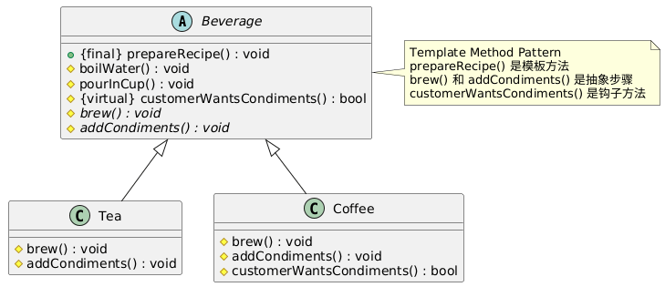

# 18. 观察者模式

## 简介

> C++ 观察者模式(Observer Pattern)
> **定义对象间的一对多依赖关系, 当一个对象(主题)状态改变时, 所有依赖它的对象(观察者)自动收到通知并更新。**

------

📌 1. 介绍

- **类型**: 行为型模式

- **别名**: 发布-订阅模式(Publish-Subscribe, 但严格来说是其同步紧耦合版本)

- 核心角色: 
  - `Subject`(主题/被观察者): 维护观察者列表, 提供注册/移除/通知接口。
  - `Observer`(观察者): 定义更新接口, 供主题调用。

- **通信方式: 推模型(Push) 或 拉模型(Pull)**
  - 推: 主题主动传递数据给观察者
  - 拉: 观察者自己从主题拉取数据(主题只发“有更新”信号)

------

🎯 2. 适用场景

 ✔ 对象状态变化需通知多个对象(如GUI控件、数据绑定)
 ✔ 解耦“数据层”与“视图层”(MVC中的核心机制)
 ✔ 事件系统、消息通知、日志监听、股票行情推送
 ✔ 避免对象间直接引用, 降低耦合

------

⚖️ 3. 优缺点

| 优点                               | 缺点                                   |
| ---------------------------------- | -------------------------------------- |
| ✅ 建立动态、松耦合的一对多关系     | ❌ 通知顺序不确定(除非显式控制)       |
| ✅ 支持广播通信, 自动通知所有观察者 | ❌ 可能导致“内存泄漏”(观察者未注销)   |
| ✅ 符合开闭原则(可自由增删观察者) | ❌ 过度使用会导致系统复杂、难以追踪依赖 |
| ✅ 易于扩展新观察者                 | ❌ 同步通知可能阻塞主题(可用异步优化) |

------

⚠️ 4. 注意事项

1. **观察者需在销毁前从主题中注销** → 否则主题通知已销毁对象 → 未定义行为(崩溃)。

2. **考虑线程安全** → 多线程环境下, 注册/注销/通知需加锁。

3. **避免在通知过程中修改观察者列表** → 可能导致迭代器失效 → 建议复制列表或延迟删除。

4. 推 vs 拉模型选择: 

   - 推: 效率高, 但耦合数据结构
   - 拉: 更灵活, 但观察者需持有主题引用
   
5. **可选: 使用 `std::function` + `std::vector` 替代继承接口** → 更轻量, 适合简单场景(见示例二)。

🧠 一句话总结观察者模式: 

> **“我变你知, 自动通知；一对多联, 解耦利器。”**

------

✅ **经典应用**: 

- GUI事件监听(按钮点击、窗口关闭)
- MVC架构中的 Model → View 通知
- 游戏成就系统、日志系统、股票行情推送
- Qt 的 `Signal/Slot`、.NET 的 `Event`、Java 的 `PropertyChangeListener`

------

📌 **学习建议**: 

- 与**发布-订阅模式**对比: 观察者是同步、紧耦合；发布订阅通过消息队列异步解耦。
- 与**中介者模式**对比: 观察者是“广播”, 中介者是“调度中心”。

## 代码

✅ 示例一: 传统接口继承方式(经典GoF风格)

```
#include <iostream>
#include <vector>
#include <algorithm>
#include <memory>

// 抽象观察者接口
class Observer {
public:
    virtual ~Observer() = default;
    virtual void update(float temperature, float humidity, float pressure) = 0;
};

// 抽象主题接口
class Subject {
public:
    virtual ~Subject() = default;
    virtual void registerObserver(std::shared_ptr<Observer> o) = 0;
    virtual void removeObserver(std::shared_ptr<Observer> o) = 0;
    virtual void notifyObservers() = 0;
};

// 具体主题: 气象站
class WeatherData : public Subject {
    std::vector<std::weak_ptr<Observer>> observers; // 使用 weak_ptr 避免循环引用
    float temperature = 0.0f;
    float humidity = 0.0f;
    float pressure = 0.0f;

public:
    void registerObserver(std::shared_ptr<Observer> o) override {
        observers.push_back(o);
    }

    void removeObserver(std::shared_ptr<Observer> o) override {
        observers.erase(
            std::remove_if(observers.begin(), observers.end(),
                [&o](const std::weak_ptr<Observer>& w) {
                    auto p = w.lock();
                    return !p || p == o;
                }),
            observers.end()
        );
    }

    void notifyObservers() override {
        // 复制到临时vector, 避免迭代中修改
        std::vector<std::shared_ptr<Observer>> validObservers;
        for (auto& w : observers) {
            if (auto obs = w.lock()) {
                validObservers.push_back(obs);
            }
        }
        for (auto& obs : validObservers) {
            obs->update(temperature, humidity, pressure);
        }
    }

    // 模拟传感器数据更新
    void setMeasurements(float temp, float hum, float pres) {
        temperature = temp;
        humidity = hum;
        pressure = pres;
        notifyObservers();
    }
};

// 具体观察者1: 当前状况显示
class CurrentConditionsDisplay : public Observer {
    float temperature = 0.0f;
    float humidity = 0.0f;
    std::weak_ptr<Subject> weatherData; // 可选: 用于拉模型

public:
    CurrentConditionsDisplay(std::shared_ptr<Subject> wd) : weatherData(wd) {}

    void update(float temp, float hum, float pres) override {
        temperature = temp;
        humidity = hum;
        display();
    }

    void display() {
        std::cout << "Current conditions: " << temperature
                  << "F degrees and " << humidity << "% humidity\n";
    }
};

// 具体观察者2: 统计显示
class StatisticsDisplay : public Observer {
    float maxTemp = 0.0f;
    float minTemp = 200.0f;
    float tempSum = 0.0f;
    int numReadings = 0;

public:
    void update(float temp, float hum, float pres) override {
        tempSum += temp;
        numReadings++;
        if (temp > maxTemp) maxTemp = temp;
        if (temp < minTemp) minTemp = temp;
        display();
    }

    void display() {
        std::cout << "Avg/Max/Min temperature = "
                  << (tempSum / numReadings) << "/" << maxTemp << "/" << minTemp << "\n";
    }
};

// 客户端使用
int main() {
    auto weatherData = std::make_shared<WeatherData>();

    auto currentDisplay = std::make_shared<CurrentConditionsDisplay>(weatherData);
    auto statsDisplay = std::make_shared<StatisticsDisplay>();

    weatherData->registerObserver(currentDisplay);
    weatherData->registerObserver(statsDisplay);

    weatherData->setMeasurements(80, 65, 30.4f);
    weatherData->setMeasurements(82, 70, 29.2f);
    weatherData->setMeasurements(78, 90, 29.2f);

    // 自动清理: shared_ptr + weak_ptr 管理生命周期
    return 0;
}
```

✅ 示例二: 现代C++函数式风格(std::function + lambda)

```
#include <iostream>
#include <vector>
#include <functional>

class WeatherStation {
    std::vector<std::function<void(float, float, float)>> observers;

public:
    void subscribe(std::function<void(float, float, float)> f) {
        observers.push_back(f);
    }

    void unsubscribe(const std::function<void(float, float, float)>& f) {
        observers.erase(
            std::remove(observers.begin(), observers.end(), f),
            observers.end()
        );
    }

    void setMeasurements(float temp, float hum, float pres) {
        for (const auto& f : observers) {
            f(temp, hum, pres);
        }
    }
};

int main() {
    WeatherStation station;

    auto display1 = [](float t, float h, float p) {
        std::cout << "[Display1] Temp: " << t << ", Hum: " << h << "\n";
    };

    auto display2 = [](float t, float h, float p) {
        std::cout << "[Display2] Got update!\n";
    };

    station.subscribe(display1);
    station.subscribe(display2);

    station.setMeasurements(25.5f, 60.0f, 1013.25f);

    return 0;
}
```

## PlantUML

```
@startuml
title Observer Pattern - Classic GoF

interface Subject {
    +registerObserver(o: Observer)
    +removeObserver(o: Observer)
    +notifyObservers()
}

interface Observer {
    +update(temperature: float, humidity: float, pressure: float)
}

class WeatherData {
    -observers: List<Observer>
    -temperature: float
    -humidity: float
    -pressure: float
    +setMeasurements(t,h,p)
}

class CurrentConditionsDisplay {
    -temperature: float
    -humidity: float
    +display()
}

class StatisticsDisplay {
    -maxTemp: float
    -minTemp: float
    -tempSum: float
    -numReadings: int
    +display()
}

Subject <|.. WeatherData
Observer <|.. CurrentConditionsDisplay
Observer <|.. StatisticsDisplay

WeatherData "1" *-- "0..*" Observer : observes >

note right of Subject
  维护观察者列表
  提供注册/移除/通知接口
end note

note right of Observer
  定义更新接口
  由具体观察者实现
end note

@enduml
```

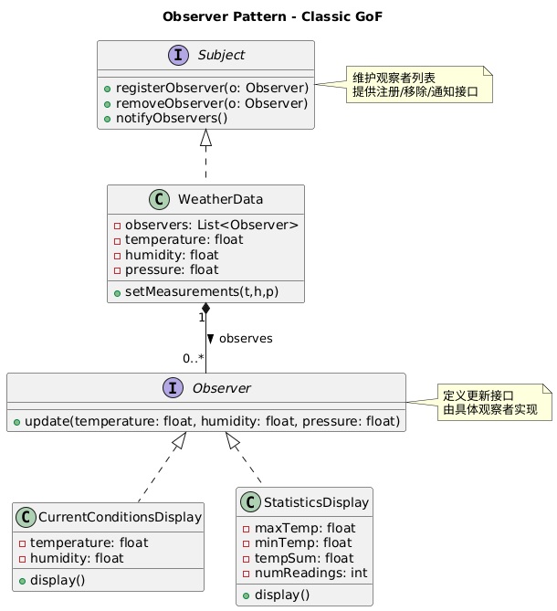


