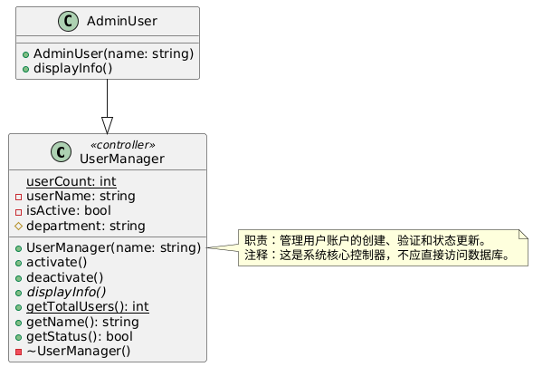
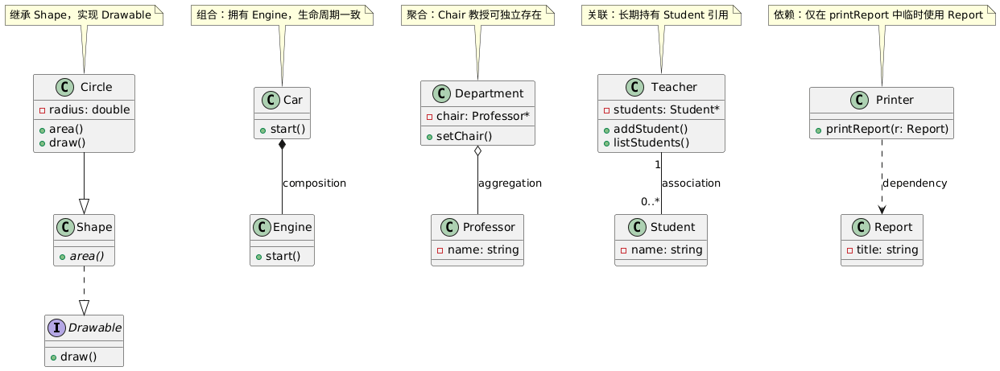

[TOC]

# 第1章 为什么要建模

## 1. 建模的重要性

- **核心目的**：建模是开发优秀软件的**核心活动**，用于：
  - 沟通系统结构与行为
  - 可视化与控制系统架构
  - 增进对系统的理解
  - 揭示简化与复用机会
  - 管理开发风险

- **类比说明(关键建模尺度)**：
  - **狗窝级系统**：可无计划、快速编码、失败代价低 → **无需建模**
  - **房屋级系统**：需初步设计图、估算资源、协调分工 → **必须建模**
  - **摩天大楼级系统**：需详尽多维模型、多方协作、高失败成本 → **必须系统化建模**

- **软件行业通病**：很多团队试图构建“大厦级”系统，却采用“狗窝式”开发 — **只写代码、无架构、无过程、无模型** → 最终系统因复杂性“自重坍塌”。

- **成功关键**：所有成功项目共性 — **采用建模**。建模是经工程验证的通用实践(建筑、航空、电子、影视、经济等)。

## 2. 模型的定义与建模四大目的

- **模型定义**：  
  
  > **模型是对现实的简化，是系统的蓝图。**  
  > - 聚焦主要元素，忽略次要细节  
  > - 可结构性(组织)或行为性(动态)  
  - 语义闭合的系统抽象
  
- **建模四大核心目的**：
  1. **可视化** — 按现实或期望样式展现系统
  2. **规约** — 明确系统结构或行为的规范
  3. **指导构造** — 提供构建系统的模板
  4. **文档化决策** — 记录设计选择与演进依据

---

✅ **本章终极结论**：
**建模不是文档装饰，而是驾驭复杂性、交付正确软件、管理风险的工程必需。不建模的大系统，终将如无图纸的大厦 — 必然倒塌。**

# 第2章 UML介绍

---

## 1. UML概述

- **本质**：UML(统一建模语言)是**标准化的图形化建模语言**，非方法、非过程、非编程语言。
- **核心用途**：对软件密集型系统进行**可视化、详述、构造、文档化**。
- **统一性价值**：融合Booch、OMT、OOSE等方法，终结“方法战争”，提供**通用符号体系**，支持跨角色沟通。
- **适用对象**：分析员、架构师、开发者、测试、项目经理、客户 — **所有参与系统构建与理解的人员**。

---

## 2. UML概念模型(建模三要素)

UML建模能力基于三大核心要素：

### 基本构造块(Building Blocks)
- **事物(Things)**：
  - **结构事物**：类、对象、接口、构件、制品、结点等 — 静态部分
  - **行为事物**：交互、状态机、活动 — 动态部分
  - **分组事物**：包 — 组织单元
  - **注释事物**：注解 — 说明信息
- **关系(Relationships)**：
  - 依赖、关联、泛化、实现 — 连接构造块的语义纽带
- **图(Diagrams)**：
  - 由构造块+关系组成，从特定视角描述系统(如类图、顺序图、部署图等)
  - 类图、对象图、构件图、组合结构图、用况图、顺序图、通信图、状态图、活动图、部署图、包图、定时图、交互概览图；

### 用机制(Common Mechanisms)
- **规格说明(Specification)**：每个图形元素背后有精确语义定义。
- **修饰(Adornment)**：如多重性、可见性、角色名等，增强语义表达。
- **通用划分(Common Divisions)**：
  - 类/对象(抽象/实例)
  - 接口/实现(契约/履约)
- **扩展机制(Extensibility)**：
  - 衍型(«interface»)、标记值({version=2.0})、约束({ordered})—— 支持定制化建模。

### 架构(Architecture)
- 通过**五视图**(用况、设计、交互、实现、部署)从多角度描述系统，确保完整性和一致性。

> ✅ 概念模型是掌握UML的基石 — 理解“用什么建”、“怎么建”、“从哪些角度看”。

---

## 3. 体系结构(五视图架构框架)

体系结构 = 关键决策集合，涵盖结构、行为、风格、非功能需求。

UML推荐**五视图建模**：

| 视图         | 关注点             | 主要受众         | 核心图例               |
| ------------ | ------------------ | ---------------- | ---------------------- |
| **用况视图** | 系统外部功能行为   | 用户、测试       | 用况图、交互图、活动图 |
| **设计视图** | 系统内部逻辑结构   | 开发、架构师     | 类图、对象图、交互图   |
| **交互视图** | 并发、同步、控制流 | 开发、性能工程师 | 顺序图、通信图、时序图 |
| **实现视图** | 代码组织、构件依赖 | 开发、配置管理   | 构件图、包图           |
| **部署视图** | 硬件拓扑、软件部署 | 运维、部署工程师 | 部署图、构件图         |

- **视图关系**：相互映射、层层支撑(如部署结点运行构件，构件实现类，类支撑用况)。
- **建模自由**：可独立或联合使用视图，按需聚焦。

---

## 4. 软件开发生命周期(推荐过程框架)

UML不绑定特定过程，但推荐适配：

> **✅ 用况驱动、✅ 以体系结构为中心、✅ 迭代与增量式开发**

### 四阶段生命周期：

| 阶段     | 核心目标                        | 关键产出                     |
| -------- | ------------------------------- | ---------------------------- |
| **初始** | 验证可行性，明确范围与目标      | 愿景文档、核心用况、风险评估 |
| **细化** | **建立需求基线 + 体系结构基线** | 核心用况实现、架构原型       |
| **构造** | 增量开发功能，持续集成          | 可执行版本、测试用例         |
| **移交** | 用户验收、缺陷修复、系统演进    | 用户文档、培训材料、维护计划 |

- **核心原则**：
  - **早期确立架构**：避免后期结构性返工。
  - **用况驱动**：需求→设计→测试→交付，全程以用况为锚点。
  - **迭代增量**：每个迭代交付可执行子集，**风险驱动优先级**。

---

✅ **本章终极提炼**：

UML = **标准化建模语言**，基于**构造块+关系+图**的概念模型，通过**五视图架构**多角度描述系统，推荐采用**用况驱动、架构中心、迭代增量**的过程框架 — **为复杂软件系统提供可控、可视、可沟通的工程化建模能力。**

# 第3章 “Hello, World”

## 1. 关键抽象(Key Abstractions) → 静态结构建模

* **目的**：用最简程序展示如何识别并建模系统中的**核心类与结构关系**。
* **建模对象**：
  * 主类 `HelloWorld`
  * 父类 `Applet`
  * 依赖类 `Graphics`
* **UML表达**：
  * **类图**：矩形表示类，标注类名与关键操作(如 `paint()`)。
  * **泛化(继承)**：`HelloWorld → Applet`(空心三角实线)。
  * **依赖**：`HelloWorld → Graphics`(虚线箭头，因方法参数使用)。
* **包结构建模**：
  * 用**包图**(文件夹图标)表示Java包层级(如 `java.applet`, `java.awt`)。
  * 包间依赖用虚线箭头表示(如 `HelloWorld` 依赖 `java.applet`)。
* **核心价值**：揭示即使简单程序，其背后存在**类层次继承**与**包组织依赖**，UML可清晰表达。

> ✅ 静态视角：**“系统由哪些类组成？它们如何继承与依赖？”**

---

## 2. 机制(Mechanisms) → 动态行为建模

* **目的**：建模 `paint()` 方法**如何被调用** — 揭示程序运行时的协作流程。
* **关键问题**：谁触发？调用链如何传递？如何实现多态？
* **UML表达**：
  * **顺序图(Sequence Diagram)**：展示对象间消息传递时序。
  * 参与对象：`Thread` → `Toolkit` → `ComponentPeer` → `HelloWorld`
  * 调用流程：
    <pre style="background: none"><code identifier="3442e20123f64c92b3bc63cf517a3b3c-0" index="0" total="1">Thread → Toolkit.run()
    Toolkit → callbackLoop()
    Toolkit → ComponentPeer.handleExpose()
    ComponentPeer → paint() → 多态调用 HelloWorld.paint()</code></pre>
  * **角色标注**：如 `target: HelloWorld`，明确协作中对象职责。
* **核心价值**：展示**框架回调机制**与**多态执行**，说明逻辑方法如何在运行时被外部环境激活。

> ✅ 动态视角：**“对象如何协作？控制流如何传递？行为如何被触发？”**

---

## 3. 制品(Artifacts) → 物理实现建模

* **目的**：从**物理文件与部署**视角建模程序组成。
* **逻辑 vs 物理**：
  * 逻辑：类、方法(前面类图)
  * 物理：源文件、编译产物、部署资源
* **UML表达**：
  * **制品图(Artifact Diagram)**：
    * `HelloWorld.java`(源码) — `<<manifest>>` → `HelloWorld` 类
    * `HelloWorld.class`(字节码)— `<<manifest>>` → `HelloWorld` 类
    * `hello.html`(网页)— 依赖 → `HelloWorld.class`
    * `hello.jpg`(图片资源)— 被网页引用
  * **<<manifest>>**：表示制品“物理承载”逻辑元素。
  * **图标定制**：可用文件/图像图标增强可读性(UML扩展机制)。
* **核心价值**：连接**设计模型**与**实际部署**，明确源码、编译产物、资源文件的依赖关系。

> ✅ 物理视角：**“代码如何组织？文件如何依赖？系统如何部署？”**

***

✅ **本章终极提炼**：

“Hello, World!” 虽小，完整展示UML三大建模维度：

1. **静态结构**(类图、包图)→ **What** — 系统由哪些元素构成？
2. **动态行为**(顺序图)→ **How** — 元素如何协作运行？
3. **物理实现**(制品图)→ **Where/Which** — 代码与资源如何组织部署？

→ **UML不是画图，而是用多视角模型驾驭系统复杂性。**

#  第4章 类

## Introduction

| 组成部分                   | 说明                                                         | UML 表示位置            | C++ 对应物                     |
| -------------------------- | ------------------------------------------------------------ | ----------------------- | ------------------------------ |
| **名称(Name)**           | 类的名字，通常首字母大写。                                   | 第一层(顶部)          | `class ClassName { ... };`     |
| **属性(Attribute)**      | 类的成员变量，描述对象的状态。可带可见性、类型、默认值、多重性等。 | 第二层                  | 成员变量：`int age;`           |
| **操作/方法(Operation)** | 类的行为或功能，即成员函数。可带参数、返回类型、可见性、是否虚函数等。 | 第三层                  | 成员函数：`void run();`        |
| **职责(Responsibility)** | 类承担的主要责任或角色(非标准UML强制项，常用于注释或文档)。 | 通常用 `{ }` 或注释表示 | 无直接对应，可用注释或文档说明 |
| **注释(Note)**           | 对类或其成员的补充说明，可附加到任何元素。                   | 用 `note` 附加          | 用 `//` 或 `/* */` 注释        |
| **构造型(Stereotype)**   | 扩展UML语义，如 `<<interface>>`, `<<utility>>`, `<<controller>>` 等。 | 类名上方 `<< >>`        | 无直接对应，可用命名约定或注释 |
| **可见性(Visibility)**   | 属性/方法的访问权限：`+` public, `-` private, `#` protected, `~` package | 符号前缀                | `public:`, `private:` 等       |
| **静态成员(Static)**     | 用下划线或 `{static}` 标记，属于类而非实例。                 | 属性/方法名加下划线     | `static int count;`            |
| **抽象成员(Abstract)**   | 用斜体或 `{abstract}` 标记，子类必须实现。                   | 斜体或 `{abstract}`     | `virtual void f() = 0;`        |

## C++ demo

**demo与UML对照**

| UML 元素               | PlantUML 写法                            | C++ 对应代码                      |
| ---------------------- | ---------------------------------------- | --------------------------------- |
| 名称 + 构造型          | `class UserManager <<controller>>`       | 类名 + 注释中说明角色             |
| 静态属性               | `{static} userCount: int`                | `static int userCount;`           |
| 私有属性               | `- userName: string`                     | `private: string userName;`       |
| 受保护属性             | `# department: string`                   | `protected: string department;`   |
| 抽象方法               | `{abstract} + displayInfo()`             | `virtual void displayInfo() = 0;` |
| 静态方法               | `{static} + getTotalUsers(): int`        | `static int getTotalUsers()`      |
| 析构函数               | `- ~UserManager()`                       | `~UserManager()`                  |
| 注释(Note)           | `note right of UserManager ... end note` | `/** 注释内容 */`                 |
| 职责(Responsibility) | 写在 Note 中                             | 写在类注释中                      |
| 继承关系               | `AdminUser --                            | > UserManager`                    |

```
#include <iostream>
#include <string>
using namespace std;

/**
 * @brief <<controller>> 
 * 职责：管理用户账户的创建、验证和状态更新。
 * 注释：这是系统核心控制器，不应直接访问数据库。
 */
class UserManager {
private:
    static int userCount; // 静态属性：用户总数 ← {static}
    string userName;      // 私有属性
    bool isActive;        // 私有属性

protected:
    string department;    // 受保护属性，供子类使用

public:
    // 构造函数
    UserManager(string name) : userName(name), isActive(true), department("General") {
        userCount++;
    }

    // 操作/方法
    void activate() { isActive = true; }
    void deactivate() { isActive = false; }

    virtual void displayInfo() = 0; // 抽象操作 ← {abstract}

    // 静态方法
    static int getTotalUsers() {
        return userCount;
    }

    // 常规方法
    string getName() const { return userName; }
    bool getStatus() const { return isActive; }

    ~UserManager() {
        userCount--;
    }
};

// 初始化静态成员
int UserManager::userCount = 0;

// ────────────────────────────────
// 子类：继承 + 实现抽象方法
// ────────────────────────────────
class AdminUser : public UserManager {
public:
    AdminUser(string name) : UserManager(name) {}

    void displayInfo() override {
        cout << "[Admin] Name: " << getName()
             << ", Status: " << (getStatus() ? "Active" : "Inactive") << endl;
    }
};

// ────────────────────────────────
// 使用示例
// ────────────────────────────────
int main() {
    AdminUser admin("Alice");
    admin.displayInfo();
    cout << "Total Users: " << UserManager::getTotalUsers() << endl;

    return 0;
}
```

## PlantUML



```
@startuml

' ========== 类：UserManager ==========
class UserManager <<controller>> {
  {static} userCount: int
  - userName: string
  - isActive: bool
  # department: string

  + UserManager(name: string)
  + activate()
  + deactivate()
  {abstract} + displayInfo()
  {static} + getTotalUsers(): int
  + getName(): string
  + getStatus(): bool
  - ~UserManager()
}

note right of UserManager
  职责：管理用户账户的创建、验证和状态更新。
  注释：这是系统核心控制器，不应直接访问数据库。
end note

' ========== 类：AdminUser ==========
class AdminUser {
  + AdminUser(name: string)
  + displayInfo()
}

' ========== 继承关系 ==========
AdminUser --|> UserManager

@enduml
```

# 第5章 关系

## Introduction

| 名称 | 说明                                                         | 核心     | UML 表示法(文本描述)        |
| ---- | ------------------------------------------------------------ | -------- | ----------------------------- |
| 泛化 | 继承关系。子类继承父类的属性和行为。                         | 继承     | 实线 + 空心三角箭头，指向父类 |
| 实现 | 类实现接口(契约)，必须提供接口中所有方法的具体实现。       | 接口     | 虚线 + 空心三角箭头，指向接口 |
| 组合 | “强拥有”整体-部分关系，部分不能独立存在，整体控制部分生命周期。 | 强拥有   | 实线 + 实心菱形，菱形靠近整体 |
| 聚合 | “弱拥有”整体-部分关系，部分可独立存在，整体不控制部分生命周期。 | 弱拥有   | 实线 + 空心菱形，菱形靠近整体 |
| 关联 | 类之间有结构上的引用关系(如成员变量)，可以是单向或双向。   | 结构引用 | 实线(可加箭头表示方向)      |
| 依赖 | 类A临时使用类B(如方法参数、局部变量)，是最弱的关系。       | 临时引用 | 虚线 + 箭头，指向被依赖的类   |

## c++ Demo

**demo关系说明**

| 关系 | 类对                       | 说明                           |
| ---- | -------------------------- | ------------------------------ |
| 实现 | `Shape → Drawable`         | Shape 实现 Drawable 接口       |
| 泛化 | `Circle → Shape`           | Circle 继承 Shape              |
| 组合 | `Car ◆── Engine`           | Car 包含 Engine，共生死        |
| 聚合 | `Department ◇── Professor` | 系“拥有”教授，但教授可独立存在 |
| 关联 | `Teacher ── Student`       | 教师长期持有学生列表           |
| 依赖 | `Printer ..> Report`       | 打印机临时使用报告对象         |

```
#include <iostream>
#include <vector>
#include <string>
using namespace std;

// ────────────────────────────────
// 1️⃣ 实现(Realization)—— 接口
// ────────────────────────────────
class Drawable {
public:
    virtual void draw() = 0; // 纯虚函数 = 接口
    virtual ~Drawable() {}
};

// ────────────────────────────────
// 2️⃣ 泛化(Generalization)—— 继承
// ────────────────────────────────
class Shape : public Drawable { // Shape 实现 Drawable 接口
public:
    virtual double area() = 0;
    void draw() override {
        cout << "Drawing a shape" << endl;
    }
};

class Circle : public Shape { // Circle 继承 Shape
public:
    double radius;
    Circle(double r) : radius(r) {}
    double area() override { return 3.14159 * radius * radius; }
    void draw() override {
        cout << "Drawing a circle with radius " << radius << endl;
    }
};

// ────────────────────────────────
// 3️⃣ 组合(Composition)—— 强拥有
// ────────────────────────────────
class Engine {
public:
    void start() { cout << "Engine started" << endl; }
    ~Engine() { cout << "Engine destroyed" << endl; }
};

class Car {
private:
    Engine engine; // Car 构造时创建 Engine，析构时自动销毁 → 组合
public:
    void start() { engine.start(); }
};

// ────────────────────────────────
// 4️⃣ 聚合(Aggregation)—— 弱拥有
// ────────────────────────────────
class Professor {
public:
    string name;
    Professor(string n) : name(n) {}
    ~Professor() { cout << "Professor " << name << " is still alive elsewhere!" << endl; }
};

class Department {
private:
    Professor* chair; // 教授可独立存在 → 聚合
public:
    Department(Professor* p = nullptr) : chair(p) {}
    void setChair(Professor* p) { chair = p; }
    ~Department() { cout << "Department destructed, but chair professor may still exist." << endl; }
};

// ────────────────────────────────
// 5️⃣ 关联(Association)—— 结构引用
// ────────────────────────────────
class Student {
public:
    string name;
    Student(string n) : name(n) {}
};

class Teacher {
private:
    vector<Student*> students; // 教师“长期认识”学生 → 关联
public:
    void addStudent(Student* s) {
        students.push_back(s);
    }
    void listStudents() {
        for (auto s : students)
            cout << "Teaching: " << s->name << endl;
    }
};

// ────────────────────────────────
// 6️⃣ 依赖(Dependency)—— 临时使用
// ────────────────────────────────
class Report {
public:
    string title;
    Report(string t) : title(t) {}
};

class Printer {
public:
    void printReport(Report& r) { // 临时使用 Report → 依赖
        cout << "Printing report: " << r.title << endl;
    }
};

// ────────────────────────────────
// 🎯 主函数：演示所有关系
// ────────────────────────────────
int main() {
    // 实现 + 泛化
    Circle c(5.0);
    c.draw();
    cout << "Circle area: " << c.area() << endl;

    // 组合
    Car myCar;
    myCar.start();

    // 聚合
    Professor* drSmith = new Professor("Dr. Smith");
    Department csDept(drSmith);
    csDept.setChair(drSmith);
    // delete drSmith; // 教授可独立于系存在！

    // 关联
    Teacher mrLee;
    Student alice("Alice"), bob("Bob");
    mrLee.addStudent(&alice);
    mrLee.addStudent(&bob);
    mrLee.listStudents();

    // 依赖
    Report projectReport("Final Project");
    Printer hpPrinter;
    hpPrinter.printReport(projectReport);

    delete drSmith; // 手动释放，体现聚合“不控制生命周期”
    return 0;
}
```

## PlantUML



```
@startuml

' ========== 接口与继承关系 ==========
interface Drawable {
    + draw()
}

class Shape {
    + area() {abstract}
}

class Circle {
    - radius: double
    + area()
    + draw()
}

Circle --|> Shape
Shape ..|> Drawable

' ========== 组合关系 ==========
class Engine {
    + start()
}

class Car {
    + start()
}

Car *-- Engine : composition

' ========== 聚合关系 ==========
class Professor {
    - name: string
}

class Department {
    - chair: Professor*
    + setChair()
}

Department o-- Professor : aggregation

' ========== 关联关系 ==========
class Student {
    - name: string
}

class Teacher {
    - students: Student*
    + addStudent()
    + listStudents()
}

Teacher "1" -- "0..*" Student : association

' ========== 依赖关系 ==========
class Report {
    - title: string
}

class Printer {
    + printReport(r: Report)
}

Printer ..> Report : dependency

' ========== 注释说明 ==========
note top of Circle
  继承 Shape，实现 Drawable
end note

note top of Car
  组合：拥有 Engine，生命周期一致
end note

note top of Department
  聚合：Chair 教授可独立存在
end note

note top of Teacher
  关联：长期持有 Student 引用
end note

note top of Printer
  依赖：仅在 printReport 中临时使用 Report
end note

@enduml
```

