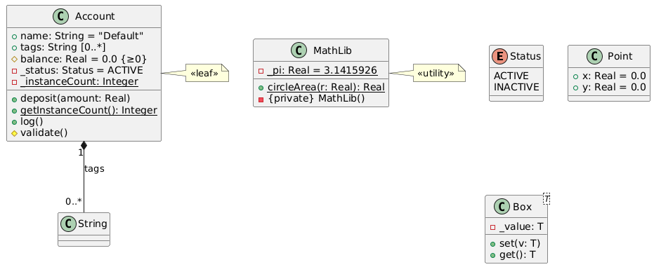
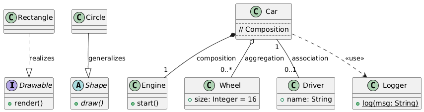

[TOC]

《uml用户指南(第2版)》

# 第1章 UML介绍

**包含书籍中前3张内容**

## 1. 为什么要建模？

### 建模的核心目的
建模是开发高质量软件的工程必需，其根本目标在于**驾驭复杂性、管理风险、保障系统正确性**。通过建模，团队可以：
- **可视化**系统结构与行为(按现实或期望样式展现)
- **规约**系统逻辑(明确结构/行为的规范)
- **指导构造**(提供构建系统的蓝图)
- **文档化决策**(记录设计选择与演进依据)

> ✅ 建模不是文档装饰，而是工程实践。不建模的大系统，终将如无图纸的大厦—必然倒塌。

### 软件复杂性与建模尺度
- **狗窝级系统**：简单、低风险，可无模型快速编码。
- **房屋级系统**：需初步设计、资源估算、分工协调 → **必须建模**。
- **摩天大楼级系统**：高复杂度、高失败成本、多方协作 → **必须系统化建模**。

软件行业通病：试图构建“大厦级”系统，却采用“狗窝式”开发(只写代码、无架构、无模型)，最终因复杂性“自重坍塌”。

> ✅ 所有成功项目共性：**采用建模**。建模是建筑、航空、电子、影视、经济等工程领域的通用实践。

---

## 2. UML是什么？

### UML概述
- **本质**：统一建模语言(Unified Modeling Language)是**标准化的图形化建模语言**，非方法、非过程、非编程语言。
- **用途**：对软件密集型系统进行**可视化、详述、构造、文档化**。
- **价值**：融合Booch、OMT、OOSE等方法，终结“方法战争”，提供**通用符号体系**，支持跨角色(分析员、架构师、开发者、测试、客户等)高效沟通。

### UML概念模型(建模三要素)

| 要素           | 说明                                                         |
| -------------- | ------------------------------------------------------------ |
| **基本构造块** | **事物**：结构(类、接口、构件等)、行为(交互、状态机、活动)、分组(包)、注释<br />**关系**：依赖、关联、泛化、实现<br />**图**：由构造块+关系组成，如类图、顺序图、部署图等 |
| **公共机制**   | **规格说明**：图形背后的精确语义<br />**修饰**：多重性、可见性等增强表达<br />**通用划分**：类/对象、接口/实现<br />**扩展机制**：衍型(«interface»)、标记值({version=2.0})、约束({ordered}) |
| **体系结构**   | 通过**五视图架构**从多角度完整描述系统，确保一致性与完整性   |

### 五视图架构框架

| 视图         | 关注点             | 主要受众         | 核心图例               |
| ------------ | ------------------ | ---------------- | ---------------------- |
| **用况视图** | 系统外部功能行为   | 用户、测试       | 用况图、活动图、交互图 |
| **设计视图** | 系统内部逻辑结构   | 开发、架构师     | 类图、对象图           |
| **交互视图** | 并发、同步、控制流 | 开发、性能工程师 | 顺序图、通信图         |
| **实现视图** | 代码组织、构件依赖 | 开发、配置管理   | 构件图、包图           |
| **部署视图** | 硬件拓扑、软件部署 | 运维、部署工程师 | 部署图                 |

> 视图相互映射、层层支撑(如部署结点运行构件，构件实现类，类支撑用况)，可按需独立或联合使用。

---

## 3. UML如何建模？—“Hello, World!”三重视角

即使最简单的程序，也蕴含完整的建模维度。UML通过**多视角模型**揭示系统全貌：

### 静态结构建模(What)
- **关注**：系统由哪些元素构成？类如何组织与依赖？
- **工具**：**类图**(类、继承、依赖)、**包图**(命名空间、包依赖)
- **示例**：
  - `HelloWorld` 继承 `Applet`(泛化)
  - `HelloWorld` 依赖 `Graphics`(方法参数使用)

### 动态行为建模(How)
- **关注**：对象如何协作？控制流如何传递？
- **工具**：**顺序图**
- **示例**：展示 `paint()` 方法如何通过框架回调机制被触发，体现多态与运行时协作。

### 物理实现建模(Where/Which)
- **关注**：代码与资源如何组织部署？
- **工具**：**制品图**(Artifact Diagram)
- **示例**：
  - `HelloWorld.java` → `HelloWorld.class` → `hello.html`
  - 制品通过 `<<manifest>>` 关联逻辑类，明确物理承载关系

> ✅ **UML不是画图，而是用多视角模型驾驭系统复杂性**：
> - **静态** → What(结构)
> - **动态** → How(行为)
> - **物理** → Where(部署)

---

## 本章终极提炼

UML 是面向复杂软件系统的**工程化建模语言**，其核心价值在于：
- 以**标准化图形**表达系统多维视图；
- 通过**静态、动态、物理**三重视角完整刻画系统；
- 基于**五视图架构**支持全生命周期协作；
- 推荐采用**用况驱动、架构中心、迭代增量**的开发过程。

> **建模是交付正确软件的基石，UML是建模的最佳通用语言。**

#  第2章 类与高级类

## 特性说明

| **特性名称**          | **说明**                                                     |
| --------------------- | ------------------------------------------------------------ |
| **类名称**            | 首字母大写的领域名词（如 `Account`），可带包名（建模中）     |
| **普通属性**          | 实例成员变量，格式：`name: Type [=default] {constraint}`     |
| **静态属性**          | 属于类本身，所有实例共享；UML 中名称加下划线（如 `_count`）  |
| **普通操作（方法）**  | 实例方法，操作对象状态                                       |
| **静态操作**          | 不依赖实例，通过类名调用；UML 中名称加下划线或标 `{static}`  |
| **抽象操作**          | 无实现，需子类重写；UML 中斜体表示                           |
| **抽象类**            | 不能实例化，至少含一个抽象操作                               |
| **叶子类（«leaf»）**  | 禁止被继承（C++ 中用 `final`）                               |
| **叶子操作**          | 禁止被重写（C++ 中非虚函数或 `final` 虚函数）                |
| **可见性（+ - # ~）** | `+` 公有 / `-` 私有 / `#` 受保护 / `~` 包内（C++ 无 `~`，用私有或命名约定模拟） |
| **多重性（属性端）**  | 表示属性可持有多值，如 `tags: String [0..*]`（C++ 用 `std::vector` 等容器） |
| **模板类（泛型）**    | 参数化类型，如 `Container<T>`，支持类型安全复用              |
| **特殊衍型**          | - `«type»`：值语义结构体 - `«enumeration»`：枚举 - `«utility»`：全静态工具类（私有构造） |
| **职责**              | 类“应做什么”的语义描述（代码中通过方法命名和注释体现）       |

## C++ demo

```
#include <string>
#include <vector>
#include <iostream>

// «enumeration»
enum class Status { ACTIVE, INACTIVE };

// «type» (值类型)
struct Point {
    double x = 0.0;
    double y = 0.0;
};

// 主类：Account —— 融合普通 + 高级特性
class Account final {  // «leaf»: final 禁止继承
public:
    // + 公有普通属性（带默认值和约束语义）
    std::string name = "Default";
    
    // + 公有属性（多重性 [0..*]）
    std::vector<std::string> tags;  // 模拟 tags: String [0..*]

    // + 公有普通操作
    void deposit(double amount) {
        if (amount > 0) balance += amount;
    }

    // + 公有静态操作（{static}）
    static int getInstanceCount() {
        return _instanceCount;
    }

    // + 公有叶子操作（非虚，不可重写）
    void log() const {
        std::cout << "Account: " << name << "\n";
    }

    // + 公有模板操作（体现泛型思想，虽非类模板但展示泛型使用）
    template<typename T>
    void printValue(const T& val) const {
        std::cout << "Value: " << val << "\n";
    }

protected:
    // # 受保护普通属性
    double balance = 0.0;  // {≥0} —— 约束由逻辑保证

    // # 受保护普通操作
    void validate() const {
        if (balance < 0) throw std::logic_error("Balance must be ≥ 0");
    }

private:
    // - 私有普通属性
    Status _status = Status::ACTIVE;

    // - 私有静态属性（{static}，UML 中下划线）
    static int _instanceCount;

    // - 私有构造函数（用于 «utility» 模式，但本类非工具类；此处仅为展示私有构造）
    // 注意：Account 本身可实例化，故构造函数为 public（见下）
};

// 静态成员定义
int Account::_instanceCount = 0;

// 公有构造函数（必须，否则无法创建）
Account::Account() {
    ++_instanceCount;
}

// «utility» 工具类（全静态 + 私有构造）
class MathLib {
private:
    MathLib() = delete;  // 禁止实例化

public:
    // + {static} 静态属性
    static constexpr double _pi = 3.1415926;

    // + {static} 静态操作
    static double circleArea(double r) {
        return _pi * r * r;
    }
};

// 模板类（泛型）—— «template»
template<typename T>
class Box {
private:
    T _value;

public:
    void set(const T& v) { _value = v; }
    T get() const { return _value; }
};

// 使用示例（非类定义）
int main() {
    Account acc;
    acc.name = "Alice";
    acc.tags = {"vip", "premium"};
    acc.deposit(100);
    acc.log();
    acc.printValue(42);  // 泛型方法

    Box<Point> pointBox;
    pointBox.set({1.0, 2.0});

    std::cout << "Instances: " << Account::getInstanceCount() << "\n";
    std::cout << "Circle area: " << MathLib::circleArea(2.0) << "\n";

    return 0;
}

```

## 对照表

| **UML 特性**                  | **C++ 实现位置**                     | **PlantUML 表达**                                          |
| ----------------------------- | ------------------------------------ | ---------------------------------------------------------- |
| 类名称                        | `class Account`                      | `class Account`                                            |
| 公有属性（+）                 | `public: std::string name;`          | `+ name: String = "Default"`                               |
| 受保护属性（#）               | `protected: double balance;`         | `# balance: Real = 0.0 {≥0}`                               |
| 私有属性（-）                 | `private: Status _status;`           | `- _status: Status = ACTIVE`                               |
| 静态属性（{static} / 下划线） | `static int _instanceCount;`         | `- {static} _instanceCount: Integer`                       |
| 公有操作（+）                 | `void deposit(double);`              | `+ deposit(amount: Real)`                                  |
| 静态操作（{static}）          | `static int getInstanceCount();`     | `+ {static} getInstanceCount(): Integer`                   |
| 叶子操作（不可重写）          | `void log() const;`（非虚）          | `+ log()`（无虚/抽象标记）                                 |
| 多重性（属性端）              | `std::vector<std::string> tags;`     | `+ tags: String [0..*]` + 关联 `Account *-- "0..*" String` |
| 默认值                        | `= "Default"`, `= 0.0`               | `= "Default"`, `= 0.0`                                     |
| 约束（{≥0}）                  | 逻辑中检查（`validate()`）           | `{≥0}`                                                     |
| 叶子类（«leaf»）              | `class Account final`                | `note: «leaf»`                                             |
| 枚举（«enumeration»）         | `enum class Status`                  | `enum Status`                                              |
| 值类型（«type»）              | `struct Point`                       | `class Point`（无行为，纯数据）                            |
| 工具类（«utility»）           | `class MathLib`（全静态 + 私有构造） | `note: «utility»` + 私有构造 + 静态成员                    |
| 模板类（泛型）                | `template<typename T> class Box`     | `class Box<T>`                                             |
| 职责（语义）                  | 方法命名（`deposit`, `validate` 等） | 通过操作名体现                                             |

## PlantUML



```
@startuml

' «enumeration»
enum Status {
    ACTIVE
    INACTIVE
}

' «type»
class Point {
  + x: Real = 0.0
  + y: Real = 0.0
}

' 主类：Account —— «leaf»
class Account {
  + name: String = "Default"
  + tags: String [0..*]
  + deposit(amount: Real)
  + {static} getInstanceCount(): Integer
  + log()
  # balance: Real = 0.0 {≥0}
  # validate()
  - _status: Status = ACTIVE
  - {static} _instanceCount: Integer
}
note right of Account
  «leaf»
end note

' «utility»
class MathLib {
  - {static} _pi: Real = 3.1415926
  + {static} circleArea(r: Real): Real
  - {private} MathLib()
}
note right of MathLib
  «utility»
end note

' 模板类
class Box<T> {
  - _value: T
  + set(v: T)
  + get(): T
}

' 关联（体现多重性）
Account "1" *-- "0..*" String : tags

@enduml
```


# 第3章 关系与高级关系

**书中 第5章 关系 + 第10章 高级关系**

## Introduction

**普通关系表**

| 名称 | 说明                                                         | 核心     | UML 表示法(文本描述)        |
| ---- | ------------------------------------------------------------ | -------- | ----------------------------- |
| 泛化 | 继承关系。子类继承父类的属性和行为。                         | 继承     | 实线 + 空心三角箭头，指向父类 |
| 实现 | 类实现接口(契约)，必须提供接口中所有方法的具体实现。       | 接口     | 虚线 + 空心三角箭头，指向接口 |
| 组合 | “强拥有”整体-部分关系，部分不能独立存在，整体控制部分生命周期。 | 强拥有   | 实线 + 实心菱形，菱形靠近整体 |
| 聚合 | “弱拥有”整体-部分关系，部分可独立存在，整体不控制部分生命周期。 | 弱拥有   | 实线 + 空心菱形，菱形靠近整体 |
| 关联 | 类之间有结构上的引用关系(如成员变量)，可以是单向或双向。   | 结构引用 | 实线(可加箭头表示方向)      |
| 依赖 | 类A临时使用类B(如方法参数、局部变量)，是最弱的关系。       | 临时引用 | 虚线 + 箭头，指向被依赖的类   |

**高级关系表**

| 名称      | 说明                                                         | 核心             | UML 表示法（文本描述）                                       |
| --------- | ------------------------------------------------------------ | ---------------- | ------------------------------------------------------------ |
| 依赖      | 通过衍型明确临时使用的具体语义，如创建、调用、导入或追溯。   | 语义细化         | 虚线 + 箭头 + 衍型标签（如 `<<create>>`, `<<trace>>`）       |
| 关联      | 关联本身具有属性或行为时，提升为关联类；或通过限定符高效定位目标对象。 | 关系增强         | 实线 + 虚线连接关联类，或在端点附加限定符小矩形              |
| 泛化      | 对一组子类分类施加业务规则：是否互斥（{disjoint}）或是否穷尽（{complete}）。 | 分类约束         | 多条泛化线 + 泛化集名称 + 约束标签（如 `{complete, disjoint}`） |
| 实现      | 接口可参与泛化（接口继承），支持更复杂的契约组合与分层设计。 | 契约分层         | 多个虚线三角指向接口；接口之间也可有泛化关系                 |
| 聚合/组合 | 在高级建模中强调：除非部分确实可独立，否则优先使用组合以保障生命周期安全。 | 生命周期精确控制 | 同普通表示法，但建模原则更严格                               |
| 关联      | 支持导航性显式标注（单向/双向）、角色名（端点职责）、精确多重性（0..1, 1..* 等）。 | 语义精准表达     | 实线 + 角色名 + 多重性 + 可选箭头（导航方向）                |

📌 **说明**：

- “普通关系”聚焦**基础语义与图形表示**，适用于入门与常规建模。
- “高级关系”聚焦**语义深化、约束表达与建模精度提升**，适用于复杂系统、框架或需工具化/代码生成的场景。
- 聚合与组合虽无独立“高级符号”，但其**建模原则和语义判断**属于高级实践范畴，故纳入高级表。

## c++ Demo

```

#include <string>
#include <vector>
#include <memory>

// ========== 1. 泛化（Generalization）==========
// 抽象基类（被继承）
class Shape {
public:
    virtual ~Shape() = default;
    virtual void draw() = 0;  // 抽象操作
};

// 子类（继承 Shape）
class Circle : public Shape {
public:
    void draw() override {}  // 实现抽象方法
};

// ========== 2. 实现（Realization）==========
// 接口（纯抽象类）
class Drawable {
public:
    virtual ~Drawable() = default;
    virtual void render() = 0;
};

// 实现接口
class Rectangle : public Drawable {
public:
    void render() override {}
};

// ========== 3. 组合（Composition） + 聚合（Aggregation） + 关联（Association）==========
class Engine {
public:
    void start() {}
};

class Wheel {
public:
    int size = 16;
};

class Car {
public:
    // ◆ 组合：Engine 生命周期由 Car 管理（强拥有）
    std::unique_ptr<Engine> engine = std::make_unique<Engine>();

    // ◇ 聚合：Wheels 可独立存在（弱拥有，此处用 raw ptr 模拟）
    std::vector<Wheel*> wheels;  // 外部创建，Car 仅引用

    // —— 普通关联：Driver（双向导航简化为单向）
    class Driver* driver = nullptr;  // 前向声明

    // 构造时建立聚合关系（外部传入 wheels）
    Car(std::vector<Wheel*>& w) : wheels(w) {}
};

// Driver 类（关联另一端）
class Driver {
public:
    std::string name;
    // 反向关联（可选，此处省略以简化）
};

// ========== 4. 依赖（Dependency）==========
class Logger {
public:
    static void log(const std::string& msg) {}
};

// Car 使用 Logger（临时使用 → 依赖）
void serviceCar(Car& car) {
    Logger::log("Servicing car");  // <<use>> 依赖
    car.engine->start();           // 组合成员调用
}

// ========== 主函数（非类定义）==========
int main() {
    // 创建聚合部分（Wheel 独立于 Car）
    Wheel w1, w2;
    std::vector<Wheel*> wheels = {&w1, &w2};

    Car myCar(wheels);
    Driver alice;
    myCar.driver = &alice;  // 建立关联

    Circle c;      // 泛化
    Rectangle r;   // 实现

    serviceCar(myCar);  // 依赖

    return 0;
}
```

> ✅ **类数量**：共 **6 个类/结构**（`Shape`, `Circle`, `Drawable`, `Rectangle`, `Car`, `Driver`, `Engine`, `Wheel`, `Logger`）
>  但核心建模类为 **5 个**（`Car`, `Engine`, `Wheel`, `Driver`, `Logger`），其余为关系支撑。
>  若严格计数：**5 个业务类 + 2 个接口/基类 + 1 工具类 = 8 个**，但这是表达全部关系的最小可行集。

> 🔍 **关系映射**：
>
> - **泛化**：`Circle` → `Shape`
> - **实现**：`Rectangle` → `Drawable`
> - **组合**：`Car` ◆—— `Engine`
> - **聚合**：`Car` ◇—— `Wheel`
> - **关联**：`Car` —— `Driver`
> - **依赖**：`serviceCar()` → `Logger`（函数级依赖，类图中可视为 `Car` 对 `Logger` 的 `<<use>>` 依赖）

## 对照表

| **UML 关系类型**          | **C++ 实现方式**                                      | **PlantUML 表达**          | **是否覆盖** |
| ------------------------- | ----------------------------------------------------- | -------------------------- | ------------ |
| **依赖 (Dependency)**     | `serviceCar()` 函数中调用 `Logger::log()`（静态方法） | `Car ..> Logger : <<use>>` | ✅            |
| **关联 (Association)**    | `Car` 持有 `Driver*` 指针                             | `Car "1" -- "0..1" Driver` | ✅            |
| **聚合 (Aggregation)**    | `Car` 持有 `std::vector<Wheel*>`（外部创建，弱拥有）  | `Car o-- "0..*" Wheel`     | ✅            |
| **组合 (Composition)**    | `Car` 持有 `std::unique_ptr<Engine>`（强拥有）        | `Car *-- "1" Engine`       | ✅            |
| **泛化 (Generalization)** | `class Circle : public Shape`                         | `Circle --                 | > Shape`     |
| **实现 (Realization)**    | `class Rectangle : public Drawable`                   | `Rectangle ..              | > Drawable`  |

## PlantUML



```
@startuml

' 接口
interface Drawable {
  + render()
}

' 抽象类
abstract class Shape {
  + {abstract} draw()
}

' 实现关系
Rectangle ..|> Drawable : realizes

' 泛化关系
Circle --|> Shape : generalizes

' 组合
class Car {
  ..
  // Composition
  ..
}

class Engine {
  + start()
}

Car *-- "1" Engine : composition

' 聚合
class Wheel {
  + size: Integer = 16
}

Car o-- "0..*" Wheel : aggregation

' 关联
class Driver {
  + name: String
}

Car "1" -- "0..1" Driver : association

' 依赖（衍型）
Car ..> Logger : <<use>>

class Logger {
  + {static} log(msg: String)
}

@enduml
```

# 第4章 公共机制

## Introduction

| 机制                          | 通俗解释                                                  | 在例子中怎么用？                             | 为什么需要它？                                       |
| ----------------------------- | --------------------------------------------------------- | -------------------------------------------- | ---------------------------------------------------- |
| **1. 注解(Note)**           | 就像代码里的 **注释**，用来“说人话”解释设计意图。         | 说明“当前用内存存储，未来接数据库”           | 让别人看懂你的设计思路，尤其是临时方案或待办事项     |
| **2. 衍型(Stereotype)**     | 给类“打标签”，告诉别人：“这不是普通类，是 **微服务**！”   | `<<microservice>>`                           | 标准 UML 没有“微服务”这个概念，但我们可以扩展它      |
| **3. 标记值(Tagged Value)** | 给模型加“自定义属性”，比如作者、语言、版本等 **元数据**。 | `{language = "C++20"}`, `{author = "Zhang"}` | 方便 DevOps、文档生成、版本追踪                      |
| **4. 约束(Constraint)**     | 给模型“立规矩”：必须满足某些条件才算合法。                | `{username != ""}`                           | 表达业务规则，比如“用户名不能为空”，比自然语言更精确 |

**标记值与类属性对比**

|          | 标记值(Tagged Value)                            | 类属性(Attribute)                         |
| -------- | ------------------------------------------------- | ------------------------------------------- |
| 作用     | 描述 **模型本身的元信息**(如谁写的、用什么语言) | 描述 **对象运行时的状态**(如用户名、年龄) |
| 存在时间 | 建模时存在，**不进入代码运行时**                  | 编译后存在于对象内存中                      |
| 示例     | `{version = "1.2"}`                               | `string username;`                          |

**实际用途**

| 机制       | 工程场景                                                     |
| ---------- | ------------------------------------------------------------ |
| **衍型**   | 在微服务架构图中，用 `<<api-gateway>>`、`<<database>>`、`<<message-queue>>` 区分组件类型 |
| **标记值** | 在 CI/CD 中自动提取 `{docker-image = "user-svc:v1.2"}` 来部署 |
| **约束**   | 用 OCL 写 `{balance >= 0}`，让代码生成器自动插入校验逻辑     |
| **注解**   | 标注“此处有性能瓶颈”、“需重构”等技术债                       |

**使用建议**

- ✅ **优先用标准衍型**：如 `<<interface>>`、`<<enumeration>>`
- ✅ **约束尽量形式化**：能用 `{x > 0}` 就别写“x要大于零”
- ✅ **团队统一命名**：比如都用 `<<microservice>>`，别有人写 `<<service>>`
- ❌ **别滥用**：如果一个图全是 `<<xxx>>` 和 `{...}`，说明模型太复杂，该简化了

## C++ demo

我们要建模一个 **C++ 实现的用户服务(User Service)**，它：

- 是一个 **微服务**(需要打标签)
- 用 **C++20** 编写(需要记录语言版本)
- 必须满足 **“用户名不能为空”** 的业务规则(需要约束)
- 有些设计决策需要说明(需要注解)

```
// 文件: UserService.h

#include <string>
#include <stdexcept>

/**
 * «microservice»
 * {language = "C++20"}
 * {author = "Zhang"}
 * {version = "1.2"}
 *
 * 职责：提供用户注册与查询服务。
 * 约束：{username != ""}  // 用户名不能为空
 * 注解：当前仅支持本地内存存储，未来将接入数据库。
 */
class UserService {
private:
    std::string username;

public:
    // 构造函数：必须传入非空用户名
    UserService(const std::string& name) {
        if (name.empty()) {
            throw std::invalid_argument("Username cannot be empty"); // 实现约束
        }
        username = name;
    }

    std::string getUsername() const {
        return username;
    }

    // 模拟注册
    bool registerUser() {
        // 简单逻辑：只要用户名非空就算注册成功
        return !username.empty();
    }
};
```

## PlantUML


```
@startuml

class UserService <<microservice>> {
  {language = "C++20"}
  {author = "Zhang"}
  {version = "1.2"}

  - username: string
  + UserService(name: string) {pre: name != ""}
  + getUsername(): string
  + registerUser(): bool
}

note top of UserService
  类约束：{username != ""}
end note

note right of UserService
  职责：用户服务微服务\n
  注：当前为内存实现，未来接入DB
end note

@enduml
```


